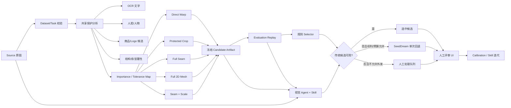
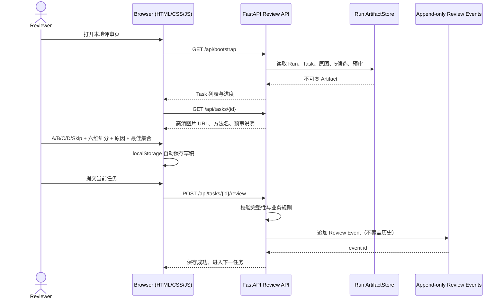

# Retarget Engine 架构说明

## 1. 项目目标

`retarget-engine` 将一张业务图片转换为指定画幅，当前正式目标固定为
`1536×1536`。系统不会只执行一个算法，而是共享分析一次、产生版本化 profile 定义的传统候选，
再由确定性评分和版本化视觉 Agent 共同选择；只有素材权利允许且传统路线失败时，才可进入
付费 AIGC 回退。

它是 Python 原型引擎，不是 Java 服务。本阶段优先固定领域对象、文件契约和模块边界，方便
后续 Java 同学用进程调用、HTTP 适配器或队列 Worker 接入，而不是提前冻结不成熟的接口。

## 2. 项目级流程



## 3. 深模块边界

| 模块 | 入口 | 隐藏的复杂度 | 稳定输出 |
| --- | --- | --- | --- |
| 数据集 | `datasets.py`, `cn60.py` | CSV/目录一致性、哈希、权利和切分 | `SourceRecord`, `TaskSpec` |
| 共享分析 | `analysis.py`, `protection_detectors.py` | OCR、人脸、目标、Logo、结构、显著性融合 | `AnalysisArtifact` 与保护图 |
| 方法 | `methods/` | 裁切、动态规划、网格优化、像素重映射 | `MethodOutput` |
| Run | `runner.py`, `storage.py` | 冻结配置、幂等恢复、资源采样、产物哈希 | `RunManifest`, Candidate |
| 自动评价 | `evaluation.py` | 候选重检、代理指标、分母完整性 | Evaluation Artifact |
| Agent | `agents.py`, `agent_skill.py` | 多模态请求、结构化响应、缓存、安全回退 | Agent Decision |
| AIGC | `providers/seedream.py` | 出域门禁、预算预留、幂等、响应校验 | Provider Result |
| 人审 | `web_app.py`, `review.py` | 草稿、追加式事件、等级和理由约束 | Review Event |
| 校准 | `calibration.py` | 等级差排序、同级容忍、Top-1 并列集合 | Calibration Report |

正式代码不得反向依赖实验脚本；UI 不直接实现算法；Provider 不决定业务路由；Agent 不覆盖
冻结 Candidate。每一层只追加新 Artifact，旧 Run 保持可回放。

## 4. 前后端流程



Web 仅默认监听 `127.0.0.1`，当前没有登录鉴权。不得将它直接绑定公网。图片接口读取 Run 中
已冻结文件，浏览器可打开原尺寸版本，不对 1536 输出做低清二次编码。

## 5. Artifact 和状态

```text
Dataset (immutable input)
  └─ Generation Run
       ├─ analysis/{source_id}/...
       ├─ candidates/{task_id}/{method_id}/candidate.png
       ├─ Evaluation Replay(s)
       ├─ Agent Replay(s)
       ├─ Review Event(s)
       └─ Benchmark / Calibration Report(s)
```

Run 状态只能沿 `RUNNING → COMPLETED` 或失败路径推进。Evaluation 和 Agent Replay 使用新 ID
追加，禁止覆盖。报告必须检查完整 Task 分母，不能把半轮结果包装成完整基准。

## 6. Java 后续接入点

建议先以进程适配器接入，Java 传入冻结配置并读取 JSON Artifact；稳定后再把以下三个端口转成
HTTP/队列接口：

1. `GenerationPort`：提交 Dataset + Target + Profile，返回 Run ID；
2. `DecisionPort`：对已完成 Evaluation 发起规则或 Agent Replay；
3. `ArtifactPort`：按 Run/Task/Method 查询 manifest 和文件。

不要让 Java 直接依赖 Python 内部类，也不要通过数据库行替代已冻结 manifest。接口字段应从
当前 Pydantic Schema 可自动导出；生产接入前仍需冻结版本、鉴权、错误码和兼容策略。

## 7. 安全与权利边界

- 商业海报和人物图默认 `LOCAL_ONLY`，不进入 Git；
- `api_egress_allowed=false` 时第三方 Provider 必须 fail closed；
- 内部受控视觉预审与第三方生成是两种不同的出域等级，审计中必须分开；
- 密钥只从运行时环境读取，不能进入日志、manifest、缓存或文档；
- 人工评审 UI 不是生产系统，公网部署前必须补鉴权、CSRF、访问日志和权限隔离。
