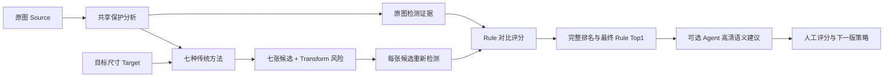
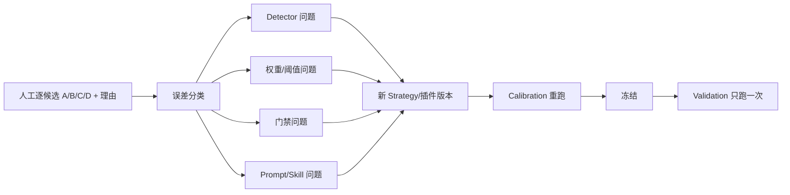

# Retarget Ability 算法原理说明

本文解释一张图片如何从原图进入重定向、候选重检、Rule 评分、Agent 建议和人工反馈。重点是说明每个指标的输入、输出和通俗意义，而不是要求接手同学先理解全部数学实现。

## 1. 系统要解决的问题

普通缩放只保证像素尺寸正确，不保证人物、文字、Logo、商品和构图仍然可用。项目因此采用“多候选 + 可审计选择”：



Generation、Evaluation、Agent 和 Human Review 是独立阶段。后一个阶段失败不会修改前一个阶段的图片或指标。

## 2. 核心数据对象

- `SourceRecord`：原图路径、尺寸、SHA-256、场景、来源与许可状态；
- `TargetSpec`：目标宽高和输出格式；
- `TaskSpec`：一张 Source 与一个 Target 的组合；
- `Candidate`：某个方法对一个 Task 的输出；
- `TransformRecord`：算法参数、耗时、裁切/形变/折叠等风险；
- `EvaluationMetric`：原图和候选比较后的指标、分数、等级和门禁；
- `StrategyBundle`：本次实际使用的评分、排序、Agent、Prompt、Skill 和插件版本。

每个对象都被写入文件并用 ID/哈希关联，因此可以回放，而不是只保留一张“最终图”。

## 3. 共享保护分析

### 3.1 为什么只分析一次原图

同一个 Task 的七种方法都使用同一张原图。如果每种方法各自分析一次，不仅慢，还可能因模型微小差异产生不一致保护区。因此 Generation 先对原图执行一次共享分析并缓存：

- PP-OCRv6 small：简体中文文字检测与识别；
- D-FINE-HGNetV2-N：人物、商品和常见物体；
- YuNet：人脸；
- Logo candidate：紧凑、显著的视觉标记候选，不声称识别具体品牌；
- 梯度、对比度、中心先验：补充没有被语义模型覆盖的显著区域。

输出是 `RegionRecord`、重要度图和容忍度图：

- 重要度高：尽量不裁、不穿 seam、不剧烈形变；
- 容忍度高：背景、留白等区域可承担更多变化。

原图检测结果以 `source.sha256` 和分析配置为条件缓存。换了像素、模型或配置，就不应复用旧分析。

### 3.2 OCR 不是只对原图做一次

“原图 OCR 在 Generation 只做一次”不等于“候选不做 OCR”。Evaluation 会对七张候选分别重新执行同一检测套件：

```text
原图 OCR 文本、框、置信度
            │
            ├── 字符召回、序列相似、文字框/边界风险
            │
候选 OCR 文本、框、置信度
```

同理，人物、人脸、商品和 Logo 候选也会在每张候选上重检，再与原图数量和类别比较。只有这样才能发现文字被压坏、人物消失或 Logo 不再可识别。

## 4. 七种重定向方法

### 4.1 `direct_warp`

把整张图直接缩放到目标宽高。

- 优点：所有像素都保留、速度快；
- 风险：横纵比例变化大时，人物、圆形、文字会被整体拉宽或压扁；
- 适用：原图比例接近目标，或素材本身可接受轻度拉伸。

### 4.2 `crop`

在多个尺度和位置中搜索一个目标比例窗口，尽量保住重要区域后裁切。

- 优点：不产生几何拉伸，视觉通常自然；
- 风险：窗口之外的信息一定会丢失；
- 适用：主体集中、边缘内容不重要的图片。

裁掉不重要背景不是天然错误；裁掉核心人物、主标题或主体 Logo 才是强风险。

### 4.3 `seam`

受限 seam carving。每次寻找一条低能量路径并删除/插入，但限制每个轴的 seam 数量，剩余尺寸差用常规缩放完成。

- 优点：保留原有受限实现的稳定性，背景可被非均匀压缩；
- 风险：路径经过人物、文字或规则结构时会产生局部扭曲；
- 受限的意义：降低大量 seam 造成的灾难性变形。

### 4.4 `seam_full`

完整 forward-energy seam carving，可以处理任意数量的 seam，并使用代理分辨率、保护权重和坐标映射回到输出。

- 优点：可完成大比例变换，不依赖最终大幅直接缩放；
- 风险：大量 seam 会积累局部形变，人物、文字和海报结构尤其敏感；
- 因此当前策略对海报/剧照有更严格的场景门禁。

### 4.5 `mesh`

保留的受限 mesh。把图像划分成规则网格，对坐标轴做单调变形；保护区域对应网格尽量少压缩。

- 优点：比直接 warp 更能保护局部；
- 风险：网格尺度过粗或约束不足时会出现局部拉扯。

### 4.6 `mesh_full`

二维三角网格优化。综合保护锚点、均匀锚点和平滑约束求解顶点，再检查三角形是否折叠和各向异性是否过大。

- 优点：能在二维上分配变形，比单轴 mesh 更完整；
- 风险：人体、文字和规则几何仍可能局部不物理；折叠必须作为硬失败证据。

### 4.7 `seam_scale`

先用 seam 完成一部分比例变化，再用常规缩放完成剩余变化。

- 优点：折中 seam 的内容感知和缩放的稳定性；
- 风险：仍可能同时存在局部 seam 形变和整体轻度拉伸。

## 5. 候选为什么必须重新检测

仅看算法的 Transform 记录不能证明最终像素可用。例如 seam 没有报错，但可能把脸拉歪；crop 技术成功，但可能切掉主标题。因此 Evaluation 对每个候选执行：

1. 图像可解码、尺寸、空白和清晰度检查；
2. OCR、人脸、人物/商品/物体、Logo 候选重检；
3. 原图与候选的内容、完整性和构图比较；
4. 结合该方法的 Transform 风险；
5. 应用 Strategy 中的分数、软调整和硬门禁。

检测器是证据生成器，不是人工真值。漏检需要由高清像素、Agent 或人工复核纠正。

## 6. Rule 评分的通俗解释

当前 v3.2.2 先计算三个 0～1 的组成分，再换算成 0～100：

```text
基础 Quality = 100 × (
  0.58 × Content
  + 0.32 × Integrity
  + 0.10 × Composition
)
```

### 6.1 Content：还在表达同一件事吗

内部综合局部特征、文字、人脸、人物、商品、Logo 和常见物体证据。它回答：

- 原图的主标题还能识别多少？
- 一男一女是否变成只剩一个人？
- 主商品或主体 Logo 是否消失？
- 关键局部视觉内容还能否对应？

文字项当前更重视字符召回，也参考序列相似。换行、移动和重排可以容忍；关键字消失或字符被扭曲到不可识别才是强风险。

### 6.2 Integrity：像素有没有明显坏掉

综合清晰度、边缘密度、色彩分布、结构线和 Transform 安全性。它回答：

- 图片是否变糊、近空白或边缘异常？
- 直线、文字、人脸、肢体是否出现不物理形变？
- 算法是否记录了过大拉伸、穿越重要区域、mesh 折叠？

色彩和结构线是软证据。裁剪或重新构图本来就会改变颜色比例和线条位置，所以不能仅凭相似度下降判 C/D。

### 6.3 Composition：成图是否仍像可交付版式

当前参考保护框边界安全和视觉中心。它不要求复制原图构图，而是避免把重要元素卡在边缘、让主体严重偏离可见区域。

### 6.4 软调整和门禁

基础分之后，策略可以按场景和方法加减小幅先验，并对部分回归施加软罚分。最后执行声明式门禁。

门禁不是“再扣几分”，而是给等级设置上限。例如：

- 主要人物几乎消失 → D；
- 突出人脸或主要人物大幅缺失 → 最多 C；
- 海报 crop 同时出现布局安全失败和主体 Logo 保留下降 → 最多 C；
- 海报/剧照的完整 seam 有已知视觉风险 → 进入更严格场景上限；
- mesh 三角形折叠、生成失败、空白等硬失败 → 按硬失败策略处理。

当前等级阈值：

```text
A: Quality ≥ 90
B: 65 ≤ Quality < 90
C: 50 ≤ Quality < 65
D: Quality < 50
```

A/B 视为机器“可用”，C/D 视为需要其他路线或人工处理。`proxy_grade` 仍是机器代理等级，不是人工真值。

## 7. 为什么相似度不能越高越好

原图从长图变成 1:1 时，某些内容损失或布局变化不可避免：

- crop 会改变颜色直方图和可见结构；
- seam/mesh 会改变局部坐标；
- 良好的重排可能和原图像素差很大，但语义完整且视觉自然；
- 直接 warp 可能像素内容全在，却让人物明显变宽。

因此 Rule 把相似度当成多项证据之一，并让“核心语义、明显不物理问题、关键文字/主体”拥有更高优先级。最终目标不是复制原图，而是得到可直接使用的目标比例图片。

## 8. Rule 完整排名

当前排序先看：

1. 技术是否有效；
2. 是否没有 hard failure；
3. 是否没有 critical regression；
4. 生成是否成功；
5. Quality 从高到低；
6. 同分时按 method ID 确定性排序。

Rule 会保留七候选完整排名，不只输出 Top1。这样 Agent 和人工能知道“为什么选它”和“第二选择是什么”。

## 9. Agent 的角色

Rule 擅长稳定计数、阈值、失败门禁和可回放分数，但对以下问题较弱：

- 人脸看似都在，五官却已不自然；
- 人数没变，但人物关系和动作语义改变；
- 文字框仍被检测到，但排版已经明显不物理；
- 一张图更完整，另一张图更美观，业务偏好如何取舍。

Agent 因此读取原图、Rule 完整排名、结构化指标和候选像素，提出视觉建议；高清阶段重点比较 Rule Top1 与 challenger，并查看文字/人物/商品局部。

Agent Skill 中沉淀：

- 允许容忍的轻微裁切和布局变化；
- 必须降级的核心语义变化；
- 人和动物缺肢、文字/物品摆放不物理、主体 Logo 消失等案例；
- 证据不足时如何回退；
- 中文理由和置信度合同。

当前 `movie60@3.2.2` 的 `agent_selection_mode=advisory_only`。即使 Agent 提出不同 Top1，生产选择仍是 Rule；Agent 结果用于人工复核和下一版 Skill/Rule 迭代。这避免把尚未独立人工验证的模型建议直接当真值。

## 10. AIGC 是独立可选路线

AIGC 不是 Rule 评分的一部分。策略可在传统 Top1 为 C/D 时形成请求，但真正调用还必须同时通过：

- 素材允许外发；
- API 权限已配置；
- 预算预留成功；
- 幂等缓存和结果校验通过。

Rule-only 命令不会调用 AIGC。AIGC 输出也必须像传统候选一样经过参考评分和视觉复核，不能因为 API 返回成功就判为可用。

## 11. 插件化与不可变策略

StrategyBundle 把“选什么实现”和“实现使用什么参数”分开：

| 层 | 可替换内容 | 当前示例 |
|---|---|---|
| Detector | OCR/人物/人脸/Logo 检测套件 | `company_cpu_v2` |
| Reference Scorer | 原图-候选比较逻辑 | `human_aligned_proxy_v3` |
| Standalone Scorer | 无原图技术检查 | `technical_no_reference_v1` |
| Rule Selector | 确定性完整排名 | `deterministic_rule_ranking_v1` |
| Agent backend | 视觉模型协议适配 | OpenAI-compatible adapter |
| Prompt | 总览、高清、配对、单图提示词 | `prompts/` |
| Skill | 视觉偏好、反例和输出合同 | `agent-skill.yaml` |

YAML 能修改权重、等级范围、门禁、场景先验、排序触发和 Agent 约束。若要替换整段算法，则新增遵循接口的 Adapter，并在 `plugin_catalog.py` 白名单注册；策略引用新的插件 ID。禁止从 YAML 任意 import Python，以免失去审计性。

每次 Evaluation 会复制完整策略到 Run 内。以后即使仓库默认策略升级，也能看到旧 Run 使用的 v1/v2/v3 文件和哈希。

## 12. 人工反馈如何变成下一版

推荐闭环：



人工有明确等级差异的候选 pair 用于判断排序是否正确；人工同等级不要求机器同分，只统计机器分差是否过大。全同级 Task 不进入 Top1 命中率。

不能逐图片写特例。可泛化的修复才进入新策略，例如“海报主体 Logo 丢失时最多 C”；样例只进入 Agent Example KB，仍需由通用规则解释。

## 13. 主要局限和后续方向

- OCR 应继续增强文字框级匹配，区分重排、换行和真实丢失；
- 增加人脸关键点、人体姿态和肢体拓扑，直接检测不物理形变；
- 商品与 Logo 需要更符合公司业务的类别和显著性模型；
- 结构线/色彩权重应按场景动态化，但分类结果和权重必须一并快照；
- Agent 应更多学习“可直接上传”的人工视觉偏好，同时保留证据不足回退；
- 独立人工 Validation 才能决定 Rule/Agent 是否真正优于旧版，机器建议不能自证准确。
