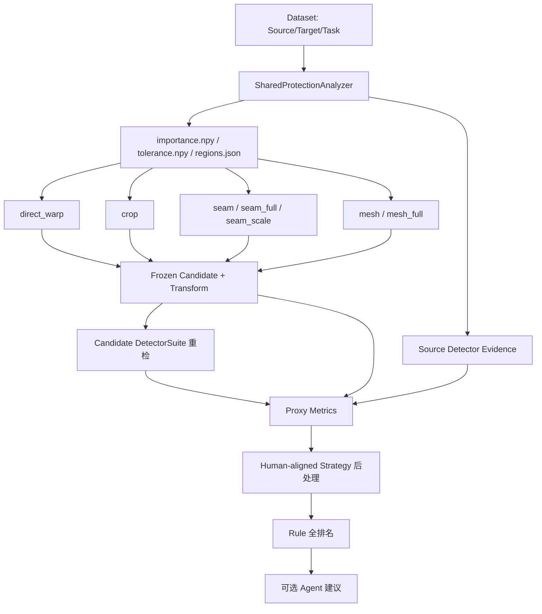

# Retarget Ability 算法与评分公式详解

这是 [算法原理说明](DEVELOPER_ALGORITHM_PRINCIPLES.md) 的工程详解版。前一份适合先读；本页用于开发、调参、排查误判和评审新 StrategyBundle。

所有公式均对应当前仓库实现。默认示例使用 `movie60@3.2.2` 和
`cn_square_v2` 七方法配置；历史 Run 必须以其自身 `config/run.yaml` 与 Evaluation
`strategy/` 快照为准。

## 1. 符号与取值范围

| 符号 | 含义 | 范围/单位 |
|---|---|---|
| `S` | 原图 RGB 数组 | `Hs×Ws×3`，uint8 |
| `C_m` | 方法 `m` 的候选图 | `Ht×Wt×3`，uint8 |
| `T=(Wt,Ht)` | 目标尺寸 | Movie60 为 1536×1536 |
| `I(x,y)` | 像素重要度 | `[0,1]`，越大越应保护 |
| `R(x,y)` | 像素容忍度 | `[0,1]`，越大越可裁/形变 |
| `B_s/B_c` | 原图/候选检测框集合 | `RegionRecord[]` |
| `q` | Rule 连续质量分 | `[0,100]` |
| `g` | Rule 代理等级 | A/B/C/D |
| `n_s,n_c` | 原图/候选某类检测数量 | 非负整数 |

`None` 与 `0` 不同：`None` 表示该指标不适用或无法计算。例如原图没有文字，OCR 保留项为 `None`，不应按 0 分惩罚。

## 2. 一次完整计算的阶段



原图共享分析属于 Generation；候选重检和原图-候选比较属于 Evaluation。二者不可因“已经检测过原图”而合并成只检测一次所有图片。

## 3. 原图保护分析

### 3.1 基础显著性

原图先转灰度并归一化到 `[0,1]`。计算：

- `G(x,y)`：Sobel 横纵梯度幅值再归一化；
- `L(x,y)`：像素与高斯局部均值之差的绝对值再归一化；
- `P(x,y)`：以画面中心为均值、宽高约 0.42 为尺度的二维高斯先验。

基础重要度：

```text
I_base(x,y) =
  (w_g·G(x,y) + w_l·L(x,y) + w_p·P(x,y))
  / (w_g + w_l + w_p)
```

Movie60 当前 Run 配置通常为：

```text
w_g = 0.40
w_l = 0.30
w_p = 0.30
```

基础容忍度：

```text
R_base(x,y) = 1 - I_base(x,y)
```

通俗意义：梯度和局部对比让轮廓/文字更重要，中心先验避免没有检测框时把画面中心随意破坏。它只提供兜底，不能理解“一男一女拜堂”等语义。

### 3.2 语义区域覆盖基础图

DetectorSuite 输出每个 `RegionRecord`：

```text
region_id, kind, rect(x1,y1,x2,y2), importance,
tolerance, confidence, source, label, attributes
```

对于必须保护区域：

```text
I_region = max(I_base, region.importance)
R_region = min(R_base, region.tolerance)
```

对于明确可移除区域：

```text
I_region = min(I_base, region.importance)
R_region = max(R_base, region.tolerance)
```

同一 `source.sha256`、同一 DetectorSuite 和同一分析配置可以复用原图检测；任何一个变化都应形成新缓存键。

### 3.3 当前检测器输入输出

#### PP-OCRv6 small

输入：原图或候选 RGB 像素。

输出：文字多边形/包围框、检测置信度、识别文本、识别置信度，统一转成语义类型 `text` 的 `RegionRecord`。

它不直接输出“文字是否保留”。保留结论由原图文字与候选文字比较得到。

#### D-FINE-HGNetV2-N

输入：RGB 图片与置信度/NMS 阈值。

输出：COCO 类别框；人物映射为 `person`，业务可视商品类映射为 `product`，其余保留为 `object`。

模型只知道训练类别，不知道“这个商品是不是海报核心商品”。显著性和 Agent/人工仍需补充主体性。

#### YuNet

输入：RGB 图片。

输出：人脸矩形与置信度，语义类型 `face`。

当前 Rule 比较人脸数量与是否完全漏检，不等价于五官关键点或面部几何质量检测。

#### Logo candidate

输入：图像中的紧凑、高对比视觉区域。

输出：`logo_candidate` 框。它只能提示“疑似标记区域仍有几个”，不声称识别品牌名称，也不保证海报标题艺术字和 Logo 能完全区分。

## 4. 七种候选算法

### 4.1 Direct Warp

缩放因子：

```text
s_x = Wt / Ws
s_y = Ht / Hs
```

各向异性：

```text
a = max(s_x/s_y, s_y/s_x)
```

对数比例压力：

```text
d_stretch = |log((Wt/Ht) / (Ws/Hs))|
```

输出通过 Lanczos 直接 resize。像素不丢，但 `d_stretch` 越大，圆、人脸、文字和身体比例越可能不自然。

### 4.2 Protection Crop

先确定所有可满足目标比例的最大窗口，再按 `scales=[1.0,0.94,0.88]` 和网格/语义中心枚举候选窗口。

窗口分数：

```text
crop_score = importance_coverage
             - 4.0 × cut_must_keep_count
             - 0.08 × center_distance
             - 0.05 × cropped_fraction
```

- `importance_coverage`：窗口内重要度积分 / 全图重要度积分；
- `cut_must_keep_count`：没有被窗口完整包含的必须保护框数；
- `center_distance`：窗口中心偏离原图中心的归一化距离；
- `cropped_fraction`：被裁掉的像素面积比例。

选择最高分窗口，再等比缩放到目标。只要存在 must-keep 被切，Generation 状态为 `UNSAFE`，但这只是技术警告；最终是否 C/D 仍由候选重检、Rule 门禁与人工视觉决定。

### 4.3 受限 Seam

基础能量：

```text
E = gradient + w_protect·I - w_tolerance·R
```

当前受限 seam 常用：

```text
w_protect = 18
w_tolerance = 3
max_seams_per_axis = 24
```

动态规划寻找累计能量最低的连续 seam。最多每轴删除 24 条，剩余尺寸差用非均匀 resize 对齐。

主要风险字段：

- `seams_removed`；
- `mean_seam_importance` / `max_seam_importance`；
- `budget_exhausted`；
- `final_alignment_anisotropy`。

受限 seam 的价值是控制 seam 累积损伤；代价是比例压力大时仍有残余整体拉伸。

### 4.4 完整 Seam

使用 forward energy。除基础梯度/保护项外，还估计删除 seam 后新邻接像素产生的视觉破坏；动态规划最小化“当前能量 + 前向邻接代价”。

为控制 CPU 成本，先在最长边 512 的代理图上移除达到目标比例所需的 seam，再把代理坐标场插值到目标画布，用原分辨率 Source 做一次 remap。

```text
E_full = ScharrGradient
         + 24·I
         - 2.5·R
         + ForwardDisruption
```

`fixed_seam_limit=None`，因此可以完成任意数量；但“能完成”不等于“视觉安全”。路径平均重要度大于 0.45 或峰值大于 0.90 时记录 `UNSAFE`。

### 4.5 Seam + Scale

和完整 seam 使用同一坐标场实现，但只让 seam 承担部分比例变化，剩余由坐标场对齐承担。类默认 `seam_fraction=0.35`；Movie60 当前 Run 显式配置为 0.45。

通俗理解：减少大量 seam 的局部破坏，同时减少纯 warp 的整体拉伸。它仍可能同时带来轻微局部形变和残余各向异性。

### 4.6 受限 Axis-aligned Mesh

把原图划成 `columns×rows` 网格，分别把重要度投影到 x/y 轴。每个段的目标分配权重：

```text
segment_weight_i = source_length_i
                   × (1 + gain·importance_i)
                   / (1 + 0.75·tolerance_i)
```

目标段长度按权重归一化，同时不得低于均匀网格段的
`minimum_cell_fraction`（当前 0.25）。x/y 分开单调映射，因此不会折叠，但可能产生局部横纵拉扯。

### 4.7 完整二维 Mesh

建立规则顶点网格和三角剖分。每个顶点刚性：

```text
rigidity_i = 0.12 + protection_gain·I_i + 0.8·(1-R_i)
```

对 x/y 分别建立加权最小二乘：

```text
min_V  E_rigid(V) + λ_anchor·E_uniform(V) + λ_smooth·E_second_order(V)
```

- `E_rigid`：高刚性边尽量保持接近等比尺度；
- `E_uniform`：避免网格整体漂移；
- `E_second_order`：相邻顶点二阶差分接近 0，减少突然折线；
- 边界用高权重固定到目标画布。

求解后检查每个三角形的有向面积。面积≤0 表示 fold-over；算法逐步把优化网格与均匀网格混合，直到无折叠。仍记录：

- `foldover_count`；
- `min/max_cell_jacobian`；
- `max_axis_anisotropy`；
- `blend_to_uniform`；
- 求解残差。

无 fold-over 只说明拓扑没有翻转，不证明人脸、手臂或文字局部自然。

## 5. 原图与候选的逐项指标

所有像素类比较最长边最多缩到 `max_analysis_edge=1024`，减少计算量；检测器按自身输入规格推理。正式人工或 Agent 高清复核仍应打开原始候选，不应只看 1024 分析图。

### 5.1 OCR 规范化

原图和候选识别文本分别执行：

1. Unicode NFKC；
2. casefold；
3. 只保留字母和数字。

设规范化原文为 `X`，候选为 `Y`。

字符召回使用多重集合：

```text
Recall_char = Σ_ch min(count_X(ch), count_Y(ch)) / |X|
```

它允许文字换行和顺序变化，但无法区分同一字符来自主标题还是边角说明。

序列相似使用 `SequenceMatcher(X,Y)`：

```text
Text = weighted_mean(
  Recall_char × 0.65,
  SequenceSimilarity × 0.35
)
```

原图规范化字符至少 4 个且字符召回 `<0.70` 时，基础评估产生
`critical_text_missing`。在 v3.2.2 human-aligned 后处理中该代码变成透明软罚分 `-2`，真正 C/D 主要由场景门禁决定，避免 OCR 单次漏检直接判死。

### 5.2 人物、人脸、商品和 Logo 数量保留

原图某类数量 `n_s>0`，候选数量 `n_c`：

```text
retained = min(1, n_c/n_s)
additions = max(0, n_c-n_s)/n_s
Preservation = retained × exp(-0.25·additions)
```

少检直接降低保留率；多检也有轻微惩罚，防止候选伪影被误认为新增主体。原图该类为 0 时返回 `None`，不凭空奖励或惩罚。

突出人脸定义为原图检测置信度≥0.75，且人脸面积占原图≥1.5%。若候选完全检不出该人脸，基础评估记录 `prominent_face_not_redetected`；v3.2.2 把它转为 `-5` 软罚分，另由明确的人脸/人物数量门禁决定等级上限。

### 5.3 物体类别 F1

对原图/候选 person、product、object 标签做多重集合交集：

```text
precision = intersection / candidate_label_count
recall    = intersection / source_label_count
ObjectF1  = 2·precision·recall / (precision+recall)
```

它检查类别集合，不检查同一个具体实例的身份。

### 5.4 清晰度与边缘保持

原图/候选分别计算灰度 Laplacian 方差和 Canny 边缘密度。通用比率分：

```text
RatioScore(v_c,v_s) = exp(-0.35·|log(v_c/v_s)|)
```

候选过糊或异常锐化都会下降。这里比较相对变化，不认为“越锐越好”。任一值接近 0 时返回 `None`。

### 5.5 色彩相似

在 HSV 的 H/S 两通道上计算 24×16 直方图并归一化：

```text
Color = clamp(1 - BhattacharyyaDistance(hist_s,hist_c), 0, 1)
```

裁剪会自然改变颜色占比，所以 Color 只进入软加权，不能单项作硬门禁。

### 5.6 ORB 内容相似

提取最多 1800 个 ORB 特征，KNN Hamming 匹配后用 Lowe ratio 0.78 过滤。设好匹配数为 `m`，两侧较小关键点数为 `n`，RANSAC 内点率为 `r`：

```text
match_score = min(1, sqrt(4m/max(1,n)))
ORB = 0.65·match_score + 0.35·r
```

它允许一定裁剪和几何变化，但对低纹理图可能返回 `None`。

### 5.7 结构线相似

对 Canny 结果运行概率 Hough 线，按 `[0,π)` 分到 18 个方向桶，以线长度累加并 L2 归一化：

```text
Line = dot(normalized_hist_s, normalized_hist_c)
```

它只比较方向分布，不比较线条具体位置。海报换布局可能仍然合理，因此也是软证据。

### 5.8 Transform Safety

v3.2.2 当前系数：

```text
WarpSafety = exp(-0.30·d_stretch)

CropSafety = clamp(importance_coverage,0,1)
             × exp(-1.0·cut_must_keep_count)

SeamSafety = exp(-1.2·mean_seam_importance
                 -0.4·log(anisotropy))

MeshSafety = exp(-0.45·log(anisotropy)
                 -8.0·foldover_count)
```

这些是算法过程风险，不是肉眼缺陷真值。尤其不能把“大量 seam”直接等同于可见损伤。

### 5.9 构图边界与中心

对候选中 text/face/person/product/logo_candidate 框，取到四边最小归一化距离 `margin_i`：

```text
BorderSafety = mean(clamp(margin_i / 0.025, 0, 1))
```

视觉中心用 Sobel 梯度作为质量，求重心 `(cx,cy)`。只有重心偏离中心超过归一化距离 0.35 后才线性下降：

```text
d = distance((cx,cy),(0.5,0.5)) / sqrt(0.5)
Center = clamp(1 - max(0,d-0.35)/0.65, 0, 1)
```

这不是美学模型，只是避免重要纹理全部挤到边缘。

## 6. 三个组件如何聚合

统一函数：

```text
WeightedMean = Σ(valid_i·weight_i) / Σ(valid_weight_i)
```

缺失指标会从分子和分母同时移除；原图无该语义类别时，对应权重为 0。

### 6.1 Content Fidelity

v3.2.2 声明权重：

| 指标 | 权重 | 生效条件 |
|---|---:|---|
| ORB feature | 0.25 | 能计算 ORB |
| Text | 0.35 | 原图有 OCR 文本 |
| Face preservation | 0.20 | 原图有人脸 |
| Person preservation | 0.20 | 原图有人物 |
| Product preservation | 0.20 | 原图有商品 |
| Logo preservation | 0.10 | 原图有 Logo candidate |
| Object label F1 | 0.20 | 有对象标签 |

权重总和可以大于 1，因为最终按实际有效权重重新归一化。

### 6.2 Visual Integrity

```text
Integrity = weighted_mean(
  Sharpness × 0.25,
  EdgeDensity × 0.20,
  Color × 0.15,
  StructureLine × 0.20,
  TransformSafety × 0.20
)
```

### 6.3 Composition

```text
Composition = weighted_mean(
  BorderSafety × 0.60,
  Center × 0.40
)
```

### 6.4 基础总分

```text
q_base = 100 × weighted_mean(
  Content × 0.58,
  Integrity × 0.32,
  Composition × 0.10
)
```

## 7. Human-aligned 后处理

`human_aligned_proxy_v3` 不修改底层检测证据，而是从三个组件重新组合基础分，追加透明调整和门禁。

### 7.1 当前软调整

| 条件 | 分数变化 |
|---|---:|
| person 场景 | +8 |
| video_cover 场景 | +2 |
| direct_warp | +6 |
| seam | +5 |
| seam_scale | +3 |
| mesh_full | +1 |
| seam_full | -8 |

这些是代理开发集先验，不是算法质量定律。调整后的分数 clamp 到 `[0,100]`。

基础回归软罚分：

| 回归 | 分数变化 |
|---|---:|
| critical_text_missing | -2 |
| severe_global_stretch | -2 |
| prominent_face_not_redetected | -5 |

### 7.2 分数到等级

```text
A: q ≥ 90
B: 65 ≤ q < 90
C: 50 ≤ q < 65
D: q < 50
```

阈值完全来自 `scoring.yaml`，可以在新 Strategy 版本中把 A 改为 80；不得直接修改已经冻结的 v3.2.2。

### 7.3 声明式门禁

门禁使用 AND 语义：同一 gate 的全部 `conditions` 都满足才命中；缺失指标不命中。场景和方法过滤先执行。

当前门禁族：

- 主人物/突出人脸几乎消失：D；
- 主人物/人脸大幅缺失：最多 C；
- movie_poster/film_still 的 seam_full 固有风险：最多 C，严重组合风险可到 D；
- film_still crop 关系丢失：D 或 C；
- 海报 crop 的主体块、Logo 与可见完整性损失：C；
- 海报 mesh/seam 的主体实例、文字损失：C；
- video_cover 的 crop/mesh/seam_full/seam_scale 组合损失：C；
- person mesh 可见完整性损失：C；
- 任一 hard failure：最终最多为策略声明的 D。

每次命中的 gate ID 写入 `human_alignment_matched_gates`，不会只留下不可解释的等级。

## 8. Rule 完整排名

v3.2.2 排序键按顺序比较：

```text
technical_valid desc
hard_failures_absent desc
critical_regressions_absent desc
generation_success desc
quality_score desc
method_id asc
```

前面的键优先级高于后面。技术失败的高分候选不会压过技术有效候选；完全同分时 method ID 保证回放确定性。

## 9. Agent 输入、输出与部署权限

### 9.1 输入

- Source 原图；
- 七候选总览；
- Rule 完整排名和每候选结构化指标；
- 明确 Rule Top1；
- Rule Top1 与最多两个 challenger 的高清整图；
- 海报/人物/商品任务的文字框、人物框、商品框局部；
- Strategy 内冻结的 Prompt 和 Skill。

### 9.2 输出

- 七候选排序；
- 最多两个 challenger；
- 每个高清候选的 A/B/C/D 建议、可直接使用、内容保留、缺陷码、中文理由和置信度；
- Rule Top1 vs challenger 的配对证据；
- Schema/超时/回退记录。

### 9.3 当前部署

`movie60@3.2.2`：

```text
agent_selection_mode = advisory_only
combined_grade_source = rule_metric
```

Agent 可发现 Rule 盲区并向人工解释，但不能自动改变生产 Top1 或等级。

## 10. 为什么当前 Agent 没有超过 Rule

完整数字见 [当前数据、评分与 Agent 路线状态](reviews/movie60-v3/CURRENT_DATA_AND_ROUTE_STATUS.md)。算法层原因可归纳为：

1. Rule 直接使用精确 OCR/检测计数和 Transform 数值，Agent 需要从视觉重新估计；
2. 七候选常近似，强制排序会诱导模型提出无明确增益的 challenger；
3. Agent 严格等级偏保守，v3.2 开发集 C/D 召回 100%，但精确率仅 6.25%；
4. 模型有时把风险指标当作已发生的肉眼缺陷，理由与实际候选质量矛盾；
5. 总览 Schema 有效率在 v3.2 开发/留出仅 91.11%/93.33%；
6. 45/15 Task 太小，且标签是人工粗审认可的大模型代理建议，不是独立人工金标；
7. Rule 已在同一代理标签分布上调参，天然更贴合同集。

这也是为什么 Agent 更适合作为语义/不物理缺陷审查器，而不是直接替换确定性 Rule。

## 11. 指标是否可以动态赋权

可以，但“动态”不是运行时任意改 Python：

- 数值层：`scoring.yaml` 的 total/text/content/integrity/composition 权重；
- 场景层：`score_adjustments.scenes` 和 `gates.scenes`；
- 方法层：`score_adjustments.methods` 和 `gates.methods`；
- 等级层：A/B/C 阈值；
- 排序层：`selection.yaml`；
- Agent 层：Prompt、Skill、override 策略；
- 实现层：白名单插件 ID。

每次修改创建新不可变目录，例如 `v3_3_0/`，并在 Evaluation 保存完整快照。不要在线根据当前图片 ID 临时改权重，否则无法复现，也会形成逐图硬编码。

## 12. 误判排查顺序

当人工认为某图应 A/B，而机器判 C/D：

1. 打开候选原图，不先相信数值；
2. 检查 `hard_failures`；
3. 检查 `human_alignment_matched_gates`；
4. 对照 Source/Candidate OCR 文本和框，区分漏检与真实缺失；
5. 对照人物/人脸/商品/Logo 数量，确认是否是模型漏报；
6. 检查 Transform 风险是否真的在像素上可见；
7. 检查场景标签是否正确；
8. 判断修复应进入 Detector、权重、门禁、Prompt 还是 Skill；
9. 只将可泛化规则写入新版本；
10. 在冻结 Calibration 验证后，再对独立 Validation 跑一次。

## 13. 代码对应位置

| 原理 | 代码/配置 |
|---|---|
| 共享保护图 | `src/retarget_agent/analysis.py` |
| 检测器 | `src/retarget_agent/protection_detectors.py` |
| 七算法 | `src/retarget_agent/methods/` |
| 原图-候选指标 | `src/retarget_agent/evaluation.py` |
| human-aligned 后处理 | `src/retarget_agent/human_aligned_scoring.py` |
| Strategy 数据模型 | `src/retarget_agent/strategy.py` |
| 插件白名单 | `src/retarget_agent/plugin_catalog.py` |
| 当前评分 | `strategies/movie60/v3_2_2/scoring.yaml` |
| 当前排序 | `strategies/movie60/v3_2_2/selection.yaml` |
| 当前 Agent 门禁 | `strategies/movie60/v3_2_2/override.yaml` |
| 当前 Prompt/Skill | `strategies/movie60/v3_2_2/prompts/`、`agent-skill.yaml` |
