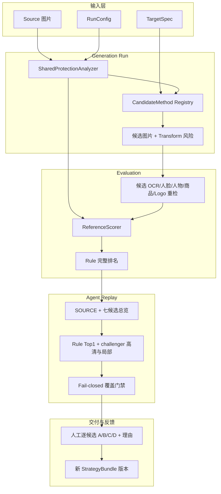
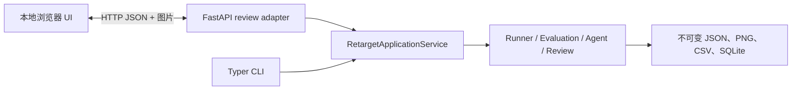

# Retarget Ability 开发交接详细讲义

## 1. 项目定位

Retarget Ability 是本地优先、可回放的图片重定向原型。它把“生成候选”“机器检测与评分”“Agent 视觉选择”“AIGC 路由”“人工反馈”分成独立阶段。任何阶段失败都不会覆盖上一阶段证据。

当前工程不提供 Java API，但 Python 边界均为稳定 JSON/文件接口，后续可由 Java 进程调用 CLI、HTTP 适配器或消息队列。

## 2. 项目级流程



### 前后端边界



前端不计算分数。它只读取冻结产物并追加人工 ReviewEvent；后端不把人工评分写回旧机器指标。

## 3. 核心数据与输入输出

| 阶段 | 主要输入 | 主要输出 |
|---|---|---|
| Dataset | `dataset.yaml`、sources/targets/tasks CSV、图片 | 校验结果、数据指纹 |
| Generation | `run.yaml`、原图 | `run.json`、`analysis/`、`candidates/`、`decisions/` |
| Evaluation | 冻结 Run、StrategyBundle | 每候选 `metrics/*.json`、summary、策略快照 |
| Agent | Evaluation、总览/高清图、Skill、Prompt | 每 Task 排名、原因、调用记录、回退原因 |
| Review | 候选与机器理由 | 人工等级、细分理由、Reviewer ID、时间 |

一个 Run 的关键目录：

```text
runs/<run-id>/
├── config/run.yaml
├── run.json
├── sources/                       # 实际输入副本与 hash
├── tasks/
├── analysis/<task-id>/            # 原图保护分析，只做一次并缓存
├── candidates/<task-id>/<method>/ # 每种方法的图、transform、状态
├── evaluations/<evaluation-id>/
│   ├── metrics/                   # 候选逐张重检并和原图比较
│   └── strategy/                  # 本次实际规则/Prompt/Skill快照
├── agent-runs/<agent-run-id>/
└── reviews/
```

## 4. OCR、人物、商品和 Logo 如何比较

### 原图是不是只做一次 OCR

是。Generation 的共享保护分析对同一 `source.sha256` 缓存原图检测结果；七种方法共用同一份原图保护区域，避免重复推理。

候选图不是复用原图结果。Evaluation 会对每张候选重新运行同一个 DetectorSuite，然后比较：

```text
原图 OCR 文本、框、置信度  ─┐
                            ├─ 字符召回、序列相似、边界安全
候选 OCR 文本、框、置信度  ─┘

原图 face/person/product/logo 数量 ─┐
                                   ├─ 数量保留率、类别 F1
候选对应数量与类别                 ─┘
```

当前 DetectorSuite：

- OCR：PP-OCRv6 small，简体中文检测和识别均在本机 CPU/ONNX Runtime 执行；
- 人脸：YuNet；
- 人物/商品/常见物体：D-FINE-HGNetV2-N COCO；
- Logo：先检测紧凑视觉标记候选，不声称识别具体品牌。

检测结果都是证据，不是绝对真值。模型漏检不能单独证明候选缺失；高清 Agent 和人工应回看实际像素。

## 5. Rule 分数如何得到

### 5.1 内容保真

通俗理解：候选是否还在讲同一件事。

```text
Content = weighted(feature, text, face, person, product, logo, object)
```

- `feature`：局部视觉特征是否还能在候选中对应；
- `text`：原图字符有多少仍可识别、顺序是否接近；
- `face/person/product/logo`：关键主体数量是否保留；
- `object`：物体类别集合是否相近。

### 5.2 视觉完整性

通俗理解：有没有被拉糊、拉歪或破坏结构。

```text
Integrity = weighted(sharpness, edge_density, color, structure_lines, transform_safety)
```

- sharpness/edge density 比较的是“相对原图是否异常变化”，不是越锐越好；
- color 用粗粒度色彩分布，避免把目标比例变化误判为逐像素错误；
- structure lines 检查明显直线方向分布；
- transform safety 使用算法自己记录的 crop/seam/mesh/warp 风险。

色彩和结构线不能作为硬门禁。裁剪本来会改变分布，构图改善也可能移动结构；因此它们只是可动态赋权的软证据。人物/文字缺失、mesh 折叠等语义或几何硬问题优先级更高。

### 5.3 构图

```text
Composition = weighted(protected_border_safety, visual_center_score)
```

它检查保护框是否被切到边缘以及视觉重心是否过度偏移，不要求候选复制原图布局。

### 5.4 总分与等级

```text
Quality = 100 × weighted(Content, Integrity, Composition)
```

当前活动 `v3_2` 的范围为 A≥90、B≥65、C≥50、D<50，再叠加声明式 C/D 门禁。范围和每层权重都在 `scoring.yaml`，下个策略版本可修改，例如把 A 改为 80；旧 Evaluation 内的快照不受影响。

`proxy_grade` 是未校准的机器代理等级，不等于人工真值。

## 6. Agent 如何工作

1. Rule 先给出全部候选的完整排名，不只是 Top1；
2. Agent 看到 SOURCE、候选总览、Rule Top1、完整排名和结构化指标；
3. Agent 可以从完整七候选排名提出最多两个经像素哈希去重的 challenger，但不能绕过门禁直接覆盖 Rule；
4. Rule Top1 与每名 challenger 分别进入高清复核，并为海报/人物/商品提供文字框、人物框和商品框局部；
5. `core_content_preserved=false`、关键文字召回下降、主体数量下降或证据矛盾时，保留可用的 Rule A/B；
6. 只有明确视觉改善且内容门禁通过，才允许 Agent 覆盖；否则回退 Rule；
7. 所有自由文本理由要求简体中文。

Prompt 和 Skill 都位于策略目录，不在 Python 中作为当前默认硬编码。总览、高清候选、配对复核、单图预审和 AIGC 生成提示词都会随策略或生成计划冻结；缓存 key 包含 Prompt/Skill hash，修改后不会误复用旧回答。

## 7. 可插拔设计

`plugin_catalog.py` 是唯一 ID → Python 实现映射。Strategy 只能引用白名单 ID，不能填写任意 import path。

| 接口 | 当前 ID | 替换时改什么 |
|---|---|---|
| DetectorSuite | `company_cpu_v2` | 新 Adapter + 注册 + 新策略版本 |
| ReferenceScorer | `human_aligned_proxy_v3` | 新评分实现 + 注册 |
| StandaloneScorer | `technical_no_reference_v1` | 新无参考实现 + 注册 |
| Rule selector | `deterministic_rule_ranking_v1` | 新排序实现 + 注册 |
| Agent backend | `openai_compatible_*` | 新后端 Adapter + 注册 |
| Prompt | `prompts/*.txt` | 新文件并由 bundle 引用 |
| Skill | `agent-skill.yaml` | 新不可变版本 |

这条 Seam 的安全代价是：新增实现必须提交代码评审，不能只在 YAML 中执行陌生 Python。收益是公司电脑运行结果可审计、可定位。

## 8. 如何基于人工反馈迭代

不要编辑已经发布的策略目录。流程是：

1. 冻结 Calibration 人工评分；
2. 统计人工不同等级 pair 的排序正确率；人工同级 pair 只统计机器分差；
3. 确认误差来自模型漏检、指标权重、硬门禁、Prompt 或 Skill；
4. 复制 `strategies/movie60/v3_2` 为新目录；
5. 修改 version、parent、规则或实现 ID；
6. `retarget-engine strategy diff` 检查变化；
7. 用新 Evaluation ID 跑 Calibration；确定后冻结；
8. Validation 只跑一次；
9. 旧策略、旧 Evaluation、旧人工记录保留。

只有参数变更时编辑 YAML；算法逻辑变更时新增插件实现并注册。两者都必须创建新 StrategyBundle，因而可追溯。

## 9. 无原图评分的边界

`score standalone` 会输出分辨率、空白、清晰度、边缘、亮度/对比度、检测框和可选 Agent 视觉预审。它不会输出内容保留分，也不会生成 Rule A/B/C/D，因为没有原图可比较。

## 10. 后续建议

- 用人工标注的简体中文海报校准 OCR 召回与视觉可用性之间的关系；
- 增加人脸关键点、人体姿态和局部几何一致性，直接捕捉 seam/mesh 人体扭曲；
- 对文字框做匹配而不只拼接全文，区分移动/换行与真实缺失；
- 根据场景动态选权重，但把场景分类和权重版本一并快照；
- Agent 更关注“是否可直接上传”的人类视觉偏好，模型检测只作证据；
- 把人工纠错沉淀为公开结构的 Example KB，私有素材继续留在 `local_data/` 或受控 Release。
