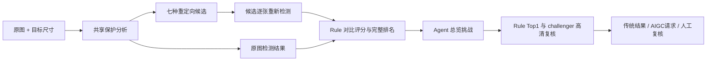

# Retarget Ability 交接大纲

这是一份讲解提纲；实际命令和字段定义见 [HANDOFF_DETAILED_GUIDE.md](HANDOFF_DETAILED_GUIDE.md)。

## 1. 项目解决什么问题

输入一张非方形图片和目标尺寸，生成七种传统候选，对每张候选做可审计评分，再由 Rule 和可选视觉 Agent 选择。传统候选都不可用时，路由层可以请求 AIGC；是否真正调用外部 API 仍由权限、素材外发和预算门禁决定。

## 2. 一张图的主流程

## 3. 交接时必须讲清的五个接口

1. `CandidateMethod`：crop、warp、受限/完整 seam、受限/完整 mesh、seam+scale。
2. `DetectorSuite`：当前 `company_cpu_v2`，历史 Run 使用兼容适配器。
3. `ReferenceScorer` / `StandaloneScorer`：有原图和无原图是不同评分合同。
4. `Selector`：Rule 完整排名与 Agent 路由分开、均为注册插件。
5. `StrategyBundle`：规则、阈值、提示词、Skill、后端和插件 ID 的不可变版本。

## 4. 当前唯一新开发默认

`company_cpu_v2`：PP-OCRv6 small（ONNX Runtime CPU）+ D-FINE-HGNetV2-N + YuNet + Logo 候选检测。旧 PP-OCRv3/CRNN/YOLOX 只用于历史 Run 回放兼容。

## 5. 如何演示

1. Windows 从零安装；
2. `scripts/run_one_image.ps1` 跑完单图重定向和 Rule；
3. `retarget-engine score reference` 单独评分一张候选；
4. 打开 `review web` 做人工评分；
5. 展示 Evaluation 内的策略快照；
6. 复制策略为新版本，修改一个权重/提示词/插件 ID，再用新 Evaluation ID 重跑。

## 6. 人工反馈下一阶段

本次不根据尚未完成的人工样本修改最终 A/B/C/D 权重。收齐人工复核后，新建策略版本，保留 v1/v2/v2.1 和旧 Evaluation，只追加 v3 校准结果。
