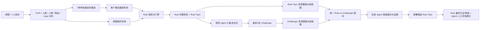

# Movie60 v3：Rule + 视觉 Agent 技术与迭代指南

## 1. 这版解决什么问题

v3 的目标不是让大模型替代 Rule，而是把两类能力拆开：

- Rule 用 OCR、人物/人脸/商品/Logo 数量、结构与变换风险做全量、确定性粗筛和排名；
- 视觉 Agent 看原图与候选的语义、自然度和可直接上传性，补足“检测数量相同但人物已变形”
  这类机器指标看不见的问题；
- Override 门禁把二者合并。证据不清、文字/主体计数倒退或语义矛盾时回退 Rule。

当前活动版本是 `strategies/movie60/v3_3/`。v1、v2、v2.1、v3、v3.1、v3.2、
v3.2.1 和 v3.2.2 都保留，不得原地修改。v3.3 中 Agent 保留高清语义审查能力，
但以 advisory-only 方式进入人工复核，不自动覆盖 Rule Top1。



## 2. Rule 的输入、输出和通俗含义

原图分析只生成一次保护区域；Evaluation 对**每张候选图**重新运行同一检测链路。候选不是
拿原图坐标硬套，而是把原图检测结果与候选检测结果按语义类别、文字内容和数量进行比较。

Rule 的基础分可概括为：

```text
Quality = 100 × (内容保真×内容权重 + 视觉完整×完整权重 + 构图×构图权重)
          ÷ 有效权重总和
          + 已声明的检测回归罚分
```

- 内容保真：主体特征、文字召回、人脸/人物/商品/Logo/对象保留；
- 视觉完整：清晰度、边缘、色彩、结构线、变换安全；
- 构图：保护区域是否贴边、视觉中心是否合理；
- v3.3 不按场景名或方法名奖励分数；
- 门禁：多个条件同时满足时把等级最高限制到 C/D，例如主要人物几乎消失。

颜色、ORB、结构线或 OCR 的差异只能作为证据。重定向本来就会裁切或改变比例，所以单项
相似度下降不能自动判 C/D。v3 把旧的部分“硬失败”改成可审计软惩罚，并只把主体严重缺失、
显著文字/Logo 风险和明显技术损坏留作门禁。

输出位于：

```text
runs/<run>/evaluations/<evaluation>/metrics/<candidate_id>.json
runs/<run>/evaluations/<evaluation>/strategy/       # 当次不可变策略快照
```

重点字段包括 `quality_score`、`proxy_grade`、`human_alignment_adjustments`、
`human_alignment_soft_regressions` 和 `human_alignment_matched_gates`。

## 3. Agent 如何工作

每个 Task 是一次独立上下文，不会把 60 张图一起发给模型。

1. 输入原图/七候选总览、Rule 完整排名、Rule Top1、每个候选的结构化指标；
2. 输出七候选完整排序、推荐候选、置信度、主体是否保留及中文理由；
3. 从完整 Agent 排名中取最多两名非 Rule challenger；
4. Rule Top1 无条件进入高清整图 + 关键局部复核；
5. 每名 challenger 也单独高清复核，再分别与 Rule Top1 配对；
6. Agent 可建议升级或降级视觉等级，但 v3.3 不自动改选方法；
7. Rule 为 A/B 时，challenger 出现关键文字召回或人物/人脸/商品/Logo 数量下降，禁止覆盖；
8. 证据冲突、置信度不足或看不清时保留 Rule，而不是编造缺陷。

Agent Skill 的案例知识在 `agent-skill.yaml`，Prompt 在 `prompts/`。案例覆盖：干净的次要裁切、
合理整体拉伸、主关系丢失、肢体/刚体非物理变形、标题与 OCR 冲突、检测器与视觉冲突、
两名 challenger 的多样性。所有自由文本要求简体中文。

输出位于：

```text
runs/<run>/agent-runs/<overview-id>/
runs/<run>/strict-reviews/<review-id>/candidate-sheets/
runs/<run>/strict-reviews/<review-id>/pair-sheets/
runs/<run>/strict-reviews/<review-id>/candidate-reviews/
runs/<run>/strict-reviews/<review-id>/pair-reviews/
runs/<run>/strict-reviews/<review-id>/decisions/
```

`decision.json` 同时保留 Rule 数值分/等级、Agent 视觉等级/理由/置信度、Combined 最终方法与
等级，不能用一个字段覆盖三种口径。

## 4. 三版如何选择

- v3：软化误杀较多的旧回归，保留主体严重缺失门禁；
- v3.1：加入场景门禁和双 challenger 接口；
- v3.2：以 C/D 召回为首要风险指标，补充组合门禁和更完整的视觉案例知识；
- v3.2.1：实验性保留 Agent 选图，把最终等级切回 Rule metric；
- v3.2.2：代理留出显示自动覆盖不稳定，部署冻结为 Rule 主决策、Agent advisory。
- v3.3：删除场景/方法加分奖励，阈值改为 89/52/42；保留回归罚分和 C/D 门禁。

标签是 420 条“人工粗审认可的大模型代理建议”，不是人工金标。先按场景冻结 45 个开发
Task 和 15 个代理保留 Task；开发集做 5-fold 诊断，冻结候选路线后才读取保留集。详细结果见
`docs/reviews/movie60-v3/`。

当前另有 18 个 Task、126 个候选的真实人工评分。v3.3 阈值只在其中 84 条 development
记录上选择，并在 42 条 proxy-holdout 人工记录上一次读出；详细区分见
`RULE_V3_3_HUMAN_THRESHOLD_REPORT.md`。

## 5. 从已有 Run 重放 Rule

重放只复用已冻结的 OCR/检测/图像测量，不再生成图片，也不重跑检测器：

```powershell
.\.venv\Scripts\python.exe scripts\replay_movie60_strategy.py `
  <run-dir> `
  --source-evaluation-id <old-evaluation-id> `
  --evaluation-id <new-unique-id> `
  --strategy strategies\movie60\v3_3\bundle.yaml
```

它会校验候选完整分母，为每个来源 Metric 保存 SHA-256，并把完整 StrategyBundle 快照写进
新 Evaluation。目标目录存在时立即拒绝覆盖。

## 6. 运行 Agent

先按安装手册启动内网或本机的 OpenAI-compatible 4B 视觉服务，并确认端点健康。总览：

```powershell
.\.venv\Scripts\python.exe scripts\run_movie60_rule_anchored_agent.py overview `
  <run-dir> --evaluation-id <evaluation-id> --phase development `
  --task-ids-file docs\reviews\movie60-v3\proxy-split-45dev-15holdout.json `
  --backend-url http://127.0.0.1:18101/v1 --model <内部部署名> `
  --strategy strategies\movie60\v3_3\bundle.yaml `
  --agent-run-id <new-overview-id> --comparison-dir <rule-aware-overview-dir>
```

高清复核：

```powershell
.\.venv\Scripts\python.exe scripts\run_movie60_rule_anchored_agent.py review `
  <run-dir> --evaluation-id <evaluation-id> --phase development `
  --task-ids-file docs\reviews\movie60-v3\proxy-split-45dev-15holdout.json `
  --backend-url http://127.0.0.1:18101/v1 --model <内部部署名> `
  --strategy strategies\movie60\v3_3\bundle.yaml `
  --overview-agent-run-id <overview-id> --review-run-id <new-review-id>
```

保留集使用 `--phase proxy_holdout`，并通过 `--calibration-review-run-id` 指向已完成且策略
哈希一致的 development review；这样无法偷偷换策略后重跑保留集。

## 7. 如何迭代 v4 而不破坏历史

1. 复制当前活动目录为新目录，例如 `v4/`；
2. 修改 `version`、`parent_strategy`、配置、Prompt、Skill 或插件 ID；
3. 如果只是阈值/权重/门禁，改 YAML；如果逻辑整体不同，实现新 Adapter 并在
   `plugin_catalog.py` 以新 ID 注册；
4. 增加测试，运行 `strategy show/diff`；
5. 使用新 Evaluation/Agent/Review ID，绝不覆盖旧 Run；
6. 将新 Bundle SHA-256 加入 `strategies/registry.yaml`；
7. 先校准/开发，冻结版本后只跑一次独立验证；
8. 人工新反馈作为新版本证据，不能回写旧策略快照或旧报告。

A/B/C/D 阈值、总权重、子指标权重、软惩罚、门禁、选择阈值、Agent Skill、Prompt、
challenger 数和覆盖策略都可插拔。旧版本仍能从 Run 内快照和 Registry 哈希完整复现。
