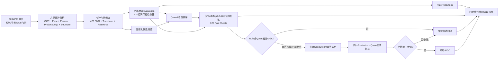
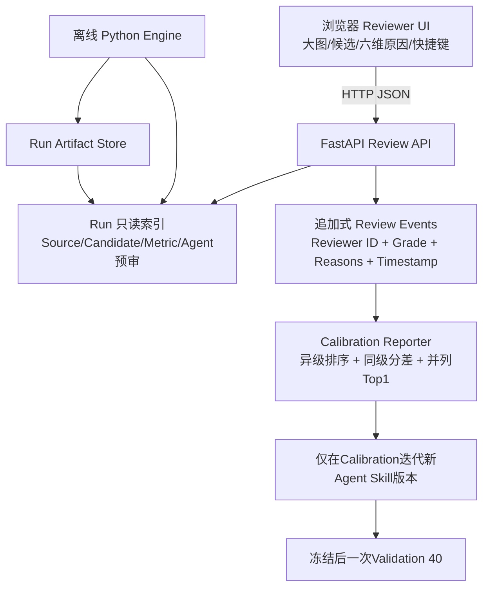
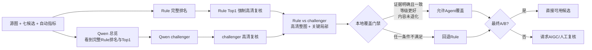

# Retarget Engine Movie Visual 60 严格重评技术报告

日期：2026-08-19（Asia/Shanghai）
状态：Generation、Evaluation、历史 Top2 复核、受控 AIGC、Rule 锚定 Agent v6 与冻结
Validation40 均已完成；最终 Agent 口径见第 16 节。

## 1. 结论先行

1. 60 张本地业务相关视觉按 1:1、1536×1536 完整生成七种传统候选，共 420 张；Run
   合同审计 PASS，0 个生成失败。
2. 自动评分口径已显著收紧。Proxy A 阈值从历史 80 提到 90、关键文字召回门禁提到
   0.70，并为 Direct Warp 增加显式拉伸等级上限。七种方法的 Proxy A 率仅
   6.7%–18.3%，不再出现宽松 A 泛滥。
3. 历史 v3 不是一次看 420 张缩略图：每 Task 看一次七候选总览，再对 Top1/Top2 做高清
   SOURCE/候选/关键区域复核。该流程结果保留为失败分析证据，不再作为最终 Agent 路由。
4. 最终 v6 明确把完整 Rule 排名和 Rule Top1 告诉 Qwen，Rule Top1 60/60 强制高清复核，
   45 个不同 challenger 做高清配对；最终 A/B/C = 10/15/35，A+B 25/60（41.7%）。
5. v3 Skill **没有证明比 Rule 更可靠**。一次辅助视觉预审对 Calibration 20 的结果为：
   Rule 胜 11、Qwen 胜 1、并列 8；A/B 可用率 60% vs 30%。根因是总览阶段偏爱 Crop，
   宽幅多主体和文字画面经常丢主体/文字。高清阶段能判 C，但 Top2 已冻结，无法回选第 3–7 名。
6. 后续按用户授权执行完整 20 张困难子集：8 张生成成功、12 张失败。自动 Proxy
   将 8/8 成功图判为 A/B，旧 Qwen4 高清逐图复核为 1B/7C；`still_003` 经用户实际
   看图纠正为 A 后，人工校准口径为 1A/1B/6C，即成功图 25%、计划全分母 10%；实际费用未回传，保守估计
   5.10–10.20 元。

## 2. 冻结实验合同

| 项目 | 冻结值 |
| --- | --- |
| Dataset | `movie-visual-60-v1` |
| Dataset fingerprint | `0a8c8db7b84b91b159bed84d52c89d165223581b15f70d17bf839105d565f3ca` |
| Run | `movie60-square-v1-20260818` |
| Run code version | `3abfd9edd7957915c5c8c4af3e20a238e3107b78+dirty` |
| 目标 | 1:1，1536×1536 |
| 分母 | 60 Task × 7 方法 = 420 Candidate |
| Split | Calibration 20；Validation 40 |
| 类别 | 人物、电影海报、影片画面、视频封面，各 15 |
| 素材边界 | 本地研究素材，不随 Git 分发；本轮 SeedDream 出域有用户显式授权 |

`+dirty` 是冻结时的真实事实，不改写为 clean commit。原图、Run、模型权重和交付包均在 Git
忽略目录或本地路径中。

## 3. 七条传统路线

| 方法 | 机制 | 主要保留能力 | 主要风险 |
| --- | --- | --- | --- |
| Direct Warp | 双轴直接缩放到正方形 | 不裁内容、最快 | 全局人物/文字/圆形拉伸 |
| Crop | 基于保护分析选裁切窗后缩放 | 几何自然 | 边界主体、Logo、文字可能消失 |
| Seam | 旧受限 Seam Carving | 限制移除缝数，避免过度累积 | 高压力比例时仍需残余缩放；最慢 |
| Seam Full | 按所需数量完整移缝 | 少裁边，可达到任意缩减量 | 多缝穿越导致人物、文字和区域扭曲 |
| Mesh | 旧受限网格形变 | 平滑、快、保留边界 | 局部/全局各向异性，可能挤压主体 |
| Mesh Full | 完整网格优化 | 比旧 Mesh 更强的目标适配 | 仍可能局部拉伸；保护图不是视觉真值 |
| Seam+Scale | 有限 Seam 后残余缩放 | 速度/形变折中 | 同时继承局部缝形变和全局缩放风险 |

七方法共享同一份 OCR/人脸/人物/商品/Logo/结构保护分析。后续 Evaluation、Agent 和 Review
全部是追加 Artifact，不修改这 420 张候选像素。

## 4. 项目级流程

## 5. 前后端与人工评审边界

UI 不直接生成图片、不调用 Provider、不覆盖机审；大模型预审也不是人工 ReviewEvent。Java 后续可
通过稳定 JSON Schema 接 API/队列/对象存储，但当前原型不声称已实现 Java 接口。

## 6. Generation 合同和时延

审计结果：420/420 候选、420/420 像素尺寸与 SHA-256、420/420 Transform、60/60 七方法
集合、60/60 共享分析均 PASS；每种方法跨 60 个不同源图均有 60 个唯一输出，0 FAILED。

| 方法 | SUCCESS | UNSAFE | FAILED | 平均秒 | P95秒 |
| --- | ---: | ---: | ---: | ---: | ---: |
| Crop | 22 | 38 | 0 | 0.720 | 1.014 |
| Direct Warp | 60 | 0 | 0 | 0.700 | 1.019 |
| Mesh | 60 | 0 | 0 | 0.730 | 1.044 |
| Mesh Full | 37 | 23 | 0 | 1.260 | 1.669 |
| Seam | 60 | 0 | 0 | 14.210 | 23.370 |
| Seam Full | 16 | 44 | 0 | 8.100 | 11.513 |
| Seam+Scale | 25 | 35 | 0 | 4.360 | 6.182 |

`UNSAFE` 仅表示变换路径触碰共享保护区等技术风险，不是视觉等级上限；反之 `SUCCESS` 也不证明
没有形变。

## 7. 严格自动 Evaluation

有效 Evaluation：`movie60-auto-strict-v1p2-20260818`，420/420，813.83 秒。

| 方法 | Quality均值 | Proxy A | Proxy A率 | Proxy A/B成功率 |
| --- | ---: | ---: | ---: | ---: |
| Crop | 76.15 | 10 | 16.7% | 31.7% |
| Direct Warp | 77.29 | 10 | 16.7% | 31.7% |
| Mesh | 75.63 | 4 | 6.7% | 33.3% |
| Mesh Full | 79.64 | 11 | 18.3% | 38.3% |
| Seam | 78.74 | 10 | 16.7% | 43.3% |
| Seam Full | 78.94 | 9 | 15.0% | 30.0% |
| Seam+Scale | 80.32 | 9 | 15.0% | 41.7% |

严格阈值：A≥90、B≥72、关键文字召回≥0.70。Direct Warp 的 `d_stretch≥0.15`
最高 B，`d_stretch≥0.45` 最高 C，并记录 `severe_global_stretch`。未包含该上限的首批
Evaluation 在239/420时停止并移到 `ABORTED-movie60-auto-strict-v1-20260818`，不计结果。

## 8. Qwen4 Agent 调用与结果

固定模型 revision：`ebb281ec70b05090aa6165b016eac8ec08e71b17`。最终在 gu30 GPU0、
loopback 服务上运行；无公网监听。总览输入 60/60 保留 SOURCE 宽高比、显示七候选方法名和
状态，但 `technical_top1_marker_visible=false`。

总览：60 calls，Schema 100%，平均 2.206 秒、P95 2.431 秒；初排 Top1 为 Crop 36、
Direct Warp 12、旧 Mesh 8、Seam+Scale 3、Mesh Full 1。

高清：每 Task 固定复核 Top1/Top2 两张，60 decision、120 review、120 pair sheet；总 wall
934.8 秒，所有 Task 低于 120 秒。最终 A 12、B 11、C 37、D 0，A/B 23/60（38.3%），
42/60 请求 AIGC。六维缺陷码中高频项包括关键文字缺失、结构变形、构图损伤、文字损伤、
脸/身体变形、局部变形和全局拉伸。

Direct Warp 在 120 个复核候选中出现 40 次，其中 27 次被 `global_stretch` 确定性证据约束；
最终 11 A、6 B、23 C。A 主要来自原图本身接近正方形的样本。Seam/Full Seam 进入高清 Top2
的数量较少，但进入者大多被判 C；这不等于未入 Top2 的 Seam 已通过高清验收。

## 9. Calibration 20 的辅助视觉预审

该检查用于发现机器规则的明显问题，原始过程记录留在本机归档。它不是业务人工金标准，也不用于
宣称正式准确率。

| 指标 | Rule | Qwen4 |
| --- | ---: | ---: |
| A/B 可直接使用 | 12/20（60%） | 6/20（30%） |
| 逐图胜出 | 11 | 1 |
| 并列 | 8 | 8 |

当前 Agent 的主要问题是“选错进入高清复核的候选”，而不是高清 reviewer 完全看不见损伤。
下一版 Skill 应把保护计数与 OCR 门禁前移到总览排序：多主体计数下降、关键文字召回下降、显著
边界截断的 Crop 不得进入 Top2；只在 Calibration 20 迭代，冻结后再一次性跑 Validation 40。

## 10. AIGC 路由、质量、成本和失败

AIGC 规划并集为 44/60，付费上限冻结为 20 张难例（Calibration 8、Validation 12）。
最终精确执行 20 个 Task，没有并发、没有自动重试，每个 Task 最多一个输出。

| 结果 | 数量 | 说明 |
| --- | ---: | --- |
| 成功回图 | 8 | 生成成功率 40.0% |
| `INVALID_REQUEST` | 3 | 提交前/明确拒绝，记为不计费 |
| `PROVIDER_UNAVAILABLE` | 2 | 已提交后状态不确定，保守记可能计费 |
| `TIMEOUT` | 7 | 最长等待 1800 秒，保守记可能计费 |

成功 8 张的 Provider wall 均值 143.44 秒、P95 213.83 秒。用户要求的路线效率比较中
**不计这段生成时间**，但原始 wall 仍保存，不隐藏 Provider 时延。随后 Qwen4 对 8 张成功图
逐张执行 SOURCE-vs-AIGC 高清复核，单张均值 5.25 秒、P95 7.51 秒。

| AIGC 质量口径 | 通过 | 分母 | A+B率 |
| --- | ---: | ---: | ---: |
| 自动 Proxy，仅成功图 | 8 | 8 | 100.0% |
| 自动 Proxy，20 次计划全分母 | 8 | 20 | 40.0% |
| Qwen4 高清严格，仅成功图 | 1 | 8 | 12.5% |
| Qwen4 高清严格，20 次计划全分母 | 1 | 20 | 5.0% |
| 人工校准后，仅成功图 | 2 | 8 | 25.0% |
| 人工校准后，20 次计划全分母 | 2 | 20 | 10.0% |

旧机器复核只有 `still_002__square-1536` 为 B；`still_003__square-1536` 后由用户明确纠正为 A。
其余 6 张仍为 C，主要原因是文字改写/缺失、Logo 缺失或幻觉、人脸/肢体局部变形、结构改变。
这证明 Proxy 不得单独放行 AIGC，也证明检测器与错位局部图不得推翻清晰的完整图视觉证据。

本轮实际账单没有回传。按“成功 + 提交后不确定”共 17 次、每次 0.30–0.60 元保守估算，
成本为 **5.10–10.20 元**。公司内部 Agent token 按 0 元；不包括人工审核和运维成本。

## 11. Rule、Agent 与 AIGC 四路线

先报同口径 Proxy 基线，再报“AIGC 必须通过高清 A/B 门禁”后的可部署路由：

| 路线 | Task | Quality均值 | Proxy A率 | Proxy A/B率 | 采用AIGC |
| --- | ---: | ---: | ---: | ---: | ---: |
| Rule | 60 | 81.87 | 18.3% | 53.3% | 0 |
| Qwen4 | 60 | 79.71 | 18.3% | 46.7% | 0 |
| Rule+AIGC（人工校准门禁） | 60 | 82.26 | 21.7% | 56.7% | 2 |
| Qwen4+AIGC（人工校准门禁） | 60 | 80.43 | 21.7% | 50.0% | 2 |

上表的 Quality 仍是自动 Proxy，不是人工分。真正做过全 60 高清严格复核的是 Agent 路线：
历史 Agent 本身 23/60（38.3%），加上两张人工校准合格 AIGC 后为 25/60（41.7%）。Rule Top1 尚未对
全 60 独立做高清复核，因此不伪造 Rule 的严格通过率。

这 20 张是路由器选出的困难子集，不是随机样本。若只用它估算“纯 AIGC”，则最诚实的局部估计为：
人工校准端到端成功率 10.0%，20 张 5.10–10.20 元，每个严格可用结果的本轮观测成本为
2.55–5.10 元。不可将该难例率无条件外推到全业务分布。

## 12. Qwen GPU 资源

最终执行节点 gu30；两阶段结束后 GPU0/1 均释放到约 46/33 MiB、0% 利用率。

| 阶段 | Calls | 活跃GPU秒 | 峰值显存MiB | 活跃均功率W | 活跃Wh | 总窗口Wh |
| --- | ---: | ---: | ---: | ---: | ---: | ---: |
| 无偏总览 | 60 | 109.37 | 21,264 | 301.93 | 9.17 | 12.00 |
| 高清Top2 | 120 | 558.75 | 21,264 | 299.92 | 46.55 | 63.90 |
| 合计 | 180 | 668.12 | 21,264 | — | 55.72 | 75.89 |

按 1/2/5/10 元每 GPU 小时的内部情景价，仅用活跃 GPU 秒估算 Agent GPU 成本约
0.19/0.37/0.93/1.86 元；这不是实际账单，也不含模型首次搬运和编译。公司内部 token 成本按 0。

## 13. 如何查看证据

| 想看什么 | 路径 |
| --- | --- |
| 60源图与任务 | `runs/movie60-square-v1-20260818/sources/`、`tasks/` |
| 七候选独立PNG与Transform | `candidates/<task>/<method>/` |
| OCR/人脸/人物/商品/Logo保护分析 | `analysis/<task>/` |
| 严格自动指标 | `evaluations/movie60-auto-strict-v1p2-20260818/metrics/` |
| 无偏七候选总览 | `agent-inputs/movie60-unbiased-v1/` |
| Qwen总览排序与原因 | `agent-runs/movie60-qwen4-overview-v3-20260818/` |
| Top2逐候选高清图/六维评分 | `strict-reviews/movie60-strict-top2-v1p4-20260818/` |
| AIGC计划、20次结果、评分与高清复核 | `external-generation/` |
| 严格门禁四路线逐Task与汇总 | `benchmarks/movie60-four-arm-v3-20260819/` |
| A+B通过率与AIGC子集口径 | `benchmarks/movie60-route-pass-v3-20260819/` |
| GPU原始采样与摘要 | `resource-observations/` |
| 20个逐Task四栏对比与独立子图 | `deliverables/movie60-review/focus20/` |

交付包中的每个代表 Task 目录还会包含源图、七张候选、每方法指标、高清 sheet、严格 decision，
以及存在时的 SeedDream 原生/评测图。新的 AIGC 对比目录按 Task 分文件夹，每个包含
`00_source`、`01_rule_<method>`、`02_agent_<method>`、成功时的 `03_aigc_seedream`、
`collage.jpg` 和 `scoring.json`。拼图顶部显式标注 `RULE 选择` 与 `AGENT 选择`，同时写出
方法名、Quality、等级、评分来源和降级理由。

## 14. 未完成与下一步

1. 本轮没有业务人员人工金标准；辅助视觉预审不能替代它。
2. 历史 Agent Skill v3 未达到“比 Rule 更可靠”的目标；该问题已由第 16 节 v6 的 Rule 锚定
   流程解决为“证据不足即不覆盖”，而不是继续扩大总览 TopN。
3. Validation40 已在 v6 冻结后运行一次。下一版只能基于业务人员的 Calibration20 人工金标准
   迭代，不得反向使用 Validation40 调参。
4. AIGC 已证明“自动 Proxy 高分但高清不可用”是主要风险。下一步不是扩大付费数量，而是
   先收紧文字/Logo/人脸/结构一致性门禁，并确认 Provider 异步任务合同以降低超时的不确定计费。
5. 完成人工评审后，按有序等级 + 同级容忍报告异级排序、同级分差、全同级范围和并列最佳 Top1。
6. Java 对接、生产鉴权、队列和对象存储仍是后续工程，不属于本轮已实现能力。

## 15. 最终验证与离线交付

- AIGC 子集高清复核：8/8 有结构化结论，B/C = 1/7；
- 四路线最终报告：`movie60-four-arm-v3-20260819`；
- A+B通过率报告：`movie60-route-pass-v3-20260819`；
- 全仓单元/集成测试：`190 passed in 34.25s`；
- Ruff：`src tests scripts` 全通过；
- `git diff --check`：无空白错误，仅有既有 CRLF 将规范化为 LF 的提示；
- 旧离线目录：`deliverables/movie60-strict-20260818-final/`；
- 新的统一AIGC交付包路径见最终交付摘要；
- 代表任务：16 个，四类各 4 个；每个任务 7 张候选、2 张 Top2 高清 sheet、原始指标、
  六维理由、传统技术总览、无偏 Agent 总览和任务 README；
- 图片、Run、权重和离线包不进 Git；源码、脚本、配置和去像素文档仍处于本地工作树，
  本轮未 Commit、未 Push。

## 16. 最终 Agent 重评：Rule 锚定高清配对（v6）

本节替代第 4、5、11、14 节中把旧 `overview-v3 + Top2` 当作最终 Agent 选择结果的口径。
旧 Run 原样保留作为失败分析证据；最终 Agent 选择应读取 v6 Rule 锚定结果。

### 16.1 为什么要重做

旧流程先让 Qwen 从七候选总览中选 Top1/Top2，再只高清检查这两张。它能发现已入围候选的问题，
但 Rule Top1 可能在总览阶段被淘汰，高清 reviewer 也无法回选第 3～7 名。新版把 Rule 从“一个候选”
提升为不可绕过的默认路线：Qwen 负责提出 challenger，本地门禁负责决定是否允许覆盖。

### 16.2 冻结合同

| 项目 | 冻结值 |
| --- | --- |
| Calibration | 20 张，仅用于调整 Skill 与接口 |
| Validation | 40 张，冻结后只运行一次 |
| Agent Skill | `agent_skills/qwen4-selector/v6/skill.yaml` |
| Skill SHA256 | `239d3fe35fc7eae4d8701efed282ef59d6f5e8997688c106f16471fa6159468c` |
| Rule 输入 | 完整 7 方法有序排名、每方法自动指标、明确 Rule Top1 |
| 高清候选 | Rule Top1 必选；Qwen challenger 必选 |
| 局部证据 | 海报、多人、商品/Logo 图最多 8 组文字/人脸/人物/商品/Logo 局部 |
| 覆盖原则 | Qwen 只有明确、无矛盾的视觉证据时才能覆盖；否则回退 Rule |
| 硬保护 | 可用 Rule A/B 遇核心内容 false、关键文字召回下降或主体计数下降时禁止覆盖 |
| 时延 | 每 Task 两分钟软目标；单次请求 120 秒超时 |

### 16.3 结果

| Split | Task | Rule强制高清 | 不同候选配对 | Agent覆盖 | A | B | C | A+B | 两分钟内 |
| --- | ---: | ---: | ---: | ---: | ---: | ---: | ---: | ---: | ---: |
| Calibration | 20 | 20 | 17 | 0 | 2 | 3 | 15 | 5（25.0%） | 20 |
| Validation | 40 | 40 | 28 | 0 | 8 | 12 | 20 | 20（50.0%） | 40 |
| **合计** | **60** | **60** | **45** | **0** | **10** | **15** | **35** | **25（41.7%）** | **60** |

60 个任务级高清复核耗时均值 17.83 秒、P50 19.82 秒、P95 25.58 秒、最大 35.60 秒。
总览 60 次逻辑调用，严格阶段为 105 次候选复核加 45 次配对复核；模型在远端 GPU 上通过
loopback-only vLLM 服务运行。本轮没有调用 SeedDream，也没有新增付费 API 成本。

按场景的严格 A+B 为：人物 14/15、电影海报 6/15、影片画面 1/15、视频封面 4/15。
它说明传统方法对单人物较成熟，但复杂画面、密集文字和视频封面仍需 AIGC 或人工路线。

### 16.4 为什么 0 次覆盖仍是有效结果

Qwen 在 45/60 个任务提出了与 Rule 不同的 challenger，但没有一张同时通过全部覆盖条件。
主要阻断为：无明确视觉证据 60 次、配对未偏好 Agent 57 次、Agent 等级未优于 Rule 57 次、
证据矛盾 38 次、关键文字召回下降 5 次、Logo 数量下降 3 次、人脸下降 2 次、人物下降 1 次。

这不是把 Qwen 退化成 Rule：Qwen 仍完成语义比较、提出 challenger、分析局部缺陷并给出 AIGC
请求；只是它没有权力用不充分证据推翻可用 Rule。对当前样本，保守回退比人为制造“Agent 提升率”
更可靠。后续只有 Calibration 人工金标准证明某类证据稳定时，才应调整覆盖门禁。

`poster_006__square-1536` 是代表例：Rule 选择 Seam，Qwen 提议 Direct Warp。高清拼图同时展示
整图、文字、人脸、商品和 Logo 局部。两者最终都为 C，配对证据不一致且不支持 Agent，故保留
Rule 并请求 AIGC。个别 Qwen 自由文本摘要可能出现诸如“cap at B”但结构化维度仍为 C 的措辞
矛盾；最终裁决以结构化等级、检测指标和本地硬门禁为准，自由文本不能绕过门禁。

### 16.5 最终证据路径

| 内容 | 路径 |
| --- | --- |
| Rule-aware 七候选总览 | `agent-inputs/movie60-rule-aware-v4/` |
| Calibration 总览决策 | `agent-runs/movie60-qwen4-rule-anchor-v6p1-cal-20260819/` |
| Validation 唯一总览决策 | `agent-runs/movie60-qwen4-rule-anchor-v6-val-20260819/` |
| Calibration 高清复核 | `strict-reviews/movie60-rule-anchor-v6-cal-20260819/` |
| Validation 唯一高清复核 | `strict-reviews/movie60-rule-anchor-v6-val-20260819/` |
| 60 张逐图交付目录 | `deliverables/movie60-rule-anchored-v6-final-20260819/` |
| ZIP | `deliverables/movie60-rule-anchored-v6-final-20260819.zip` |

交付目录每个 Task 均有源图、Rule-aware 总览、Rule Top1、Qwen challenger、最终选择、候选级高清
sheet、不同候选时的 Rule-vs-Qwen 高清拼图、完整 Rule 排名与 Quality/OCR/主体指标、结构化决定和
中文 README。`all-task-results.csv/json` 可供 Java 或分析脚本直接读取；像素与 Run 仍只保留本地。

## 17. Calibration 人工纠错：still_003 AIGC 应为 A

用户对 `still_003__square-1536--seedream--v1` 完成实际看图后，明确标记为 A、可直接使用。
旧机器 C 是误杀：原图 OCR 自身识别错误，Logo 数量检测失配，且旧 sheet 把原图框按归一化
坐标映射到发生语义重构的 AIGC 图，导致文字局部裁错。完整图中的人物、片名 Logo、日期、
“七夕上映”和整体构图均正常。

该反馈已作为不可变 Calibration 记录追加，旧机器 C 不删除但不再是该候选的最终校准等级。
修复后 AIGC 使用候选自身检测框；没有候选检测框时显示完整候选而非黑块；提示词明确允许目标
画布变化、合理缩放和重新排版，OCR 与检测器数量只能作为辅助证据。详细机器证据和人工更正保存在
`deliverables/movie60-review/focus20/tasks/still_003__square-1536/`；一次性过程文档留在本机归档。
