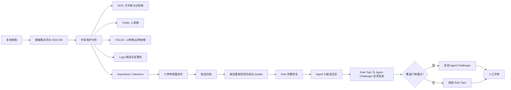

# 单张图片：重定向、Rule 评分、Agent 选择全流程

这份手册面向第一次接手 `retarget-engine` 的开发、算法和测试同学。目标是用一张本地图片，
完整复现“冻结输入 → 保护分析 → 七种重定向 → 自动评分 → Rule 排名 → Agent 总览 → 高清
复核 → 最终选择 → 人工校对”，并能够定位每一层的输入、输出和失败原因。

如果新机器尚未 Clone 仓库、没有 Python 或 `.venv`，先执行
[本地 Code Agent 新机器安装手册](CODE_AGENT_NEW_MACHINE_SETUP.md)。

> 当前正式原型固定输出 `1536×1536`。所有命令默认在
> `G:\Projects\retarget-abillity` 根目录执行。商业图片默认仅在本地使用；未经授权不要上传、
> 提交 Git 或发送第三方 API。

## 1. 先建立正确的心智模型

项目不是“调用一个模型直接生图”。它先用同一份保护分析生成七个传统候选，再由可回放的
Rule 排名，最后让视觉 Agent 只在有明确视觉证据时挑战 Rule Top1。



### 1.1 四种“结果”不能混用

| 层次 | 输出 | 含义 | 能否当人工结论 |
|---|---|---|---|
| 方法执行 | `SUCCESS / UNSAFE / FAILED` | 算法是否产出、是否触发技术风险 | 不能 |
| Rule 自动代理 | `Quality 0–100` + `proxy_a/b/c` | OCR、计数、结构、形变等自动代理 | 不能 |
| 高清视觉预审 | `A/B/C/D` + 六维理由 | 大模型按完整图和局部证据作预审 | 不能 |
| 人工评审 | `A/B/C/D/Skip` + 六维理由 | Reviewer 的最终业务标签 | 可以 |

`UNSAFE` 不是“必定 C”，`SUCCESS` 也不是“必定能用”。例如 Seam 可能技术上完成，但人物或
文字已被接缝扭曲；反过来，候选虽触发保守风险阈值，高清目视仍可能自然、完整并可直接用。

## 2. 环境安装

### 2.1 Windows：CPU 引擎环境

支持 Python `3.11–3.13`。推荐新机器固定 Python 3.11 或 3.12。

```powershell
Set-Location G:\Projects\retarget-abillity
py -3.11 -m venv .venv
.\.venv\Scripts\python.exe -m pip install --upgrade pip
.\.venv\Scripts\python.exe -m pip install -c requirements\constraints-py311-313.txt -e ".[dev]"
.\.venv\Scripts\retarget-engine.exe --help
```

核心依赖由 `pyproject.toml` 管理：NumPy、OpenCV Headless、Pillow、Pydantic、FastAPI、
Uvicorn、Requests、psutil、PyYAML 和 Typer。传统重定向、OCR、YOLOX、自动评分均在 CPU
环境运行；不需要 PyTorch。

### 2.2 下载并校验 OCR、YOLOX、人脸模型

模型文件不进 Git，由审计 manifest 从固定官方 commit 下载，并校验文件长度和 SHA-256：

```powershell
.\.venv\Scripts\python.exe scripts\materialize_analyzer_models.py
```

成功后 `models\analyzers\` 应包含：

| 文件 | 用途 | SHA-256 前 12 位 |
|---|---|---|
| `text_detection_cn_ppocrv3_2023may.onnx` | 中文文字区域检测 | `03f550c6b406` |
| `text_recognition_CRNN_CN_2021nov.onnx` | 中文文字识别 | `c760bf82d684` |
| `crnn.py` | 官方中文字符集数据 | `349e7262b1d1` |
| `face_detection_yunet_2023mar.onnx` | 人脸检测 | `8f2383e4dd3c` |
| `object_detection_yolox_2022nov.onnx` | COCO 物体检测 | `c5c2d13e59ae` |

完整 URL、许可证、字节数和 SHA-256 在
`datasets/analyzer_models_v1/model_manifest.csv`。运行配置应使用 `detector_mode: required`；
模型缺失时直接失败，不允许悄悄退化成“无 OCR/YOLO 的成功 Run”。

### 2.3 Linux GPU：视觉 Agent 环境（与 CPU 引擎分开）

Rule 全流程不依赖 GPU；只有视觉 Agent 需要一个 OpenAI-compatible 多模态服务。项目当前验证
过 4B 视觉模型、单并发、8192 上下文；实际峰值显存接近 20 GiB，因此建议 24 GiB GPU。

一个可复现的独立环境示例：

```bash
python3.10 -m venv .venv-agent
source .venv-agent/bin/activate
python -m pip install --upgrade pip
python -m pip install "vllm==0.11.0" "transformers==4.57.1" "qwen-vl-utils==0.0.14"

CUDA_VISIBLE_DEVICES=0 vllm serve Qwen/Qwen3-VL-4B-Instruct \
  --revision ebb281ec70b05090aa6165b016eac8ec08e71b17 \
  --served-model-name qwen3vl-4b \
  --host 127.0.0.1 \
  --port 18101 \
  --dtype bfloat16 \
  --max-model-len 8192 \
  --max-num-seqs 1
```

服务只绑定 `127.0.0.1`。如果 GPU 在远端，用 SSH tunnel 映射到本机，不要开放公网端口：

```powershell
ssh -N -L 18101:127.0.0.1:18101 <user>@<gpu-host>
Invoke-RestMethod http://127.0.0.1:18101/v1/models
```

项目固定 revision 是为了避免上游更新静默改变历史结果。8192 也不是随意放大：当前七候选
总览曾在 4096 上下文出现结构化输出截断。

外部一手说明：[Qwen3-VL-4B-Instruct 官方模型卡](https://huggingface.co/Qwen/Qwen3-VL-4B-Instruct)、
[vLLM 0.11 OpenAI-compatible Server](https://docs.vllm.ai/en/v0.11.0/serving/openai_compatible_server.html)。

## 3. OCR 到底输入什么、输出什么

项目 OCR 是两阶段本地 ONNX 链路，不是云 API。

### 3.1 输入与预处理

1. 输入是完整 RGB 原图；Evaluation 时每张候选也重新执行同一链路。
2. PP-OCRv3 检测器把图缩放到 `736×736`。
3. 检测器输出文字四边形和检测置信度。
4. 每个四边形从原图做透视变换，得到 `100×32` BGR 小图。
5. CRNN 输出逐时间步字符分布，CTC 去重后得到中文字符串和平均识别置信度。

### 3.2 持久化输出

源图 OCR 写进：

```text
runs/<run_id>/analysis/<task_id>/analysis.json
```

一个 `RegionRecord` 的简化形态：

```json
{
  "region_id": "text_ppocrv3_crnn_cn-001",
  "kind": "must_keep",
  "rect": {"x1": 979, "y1": 388, "x2": 1069, "y2": 417},
  "confidence": 0.989565,
  "source": "text_ppocrv3_crnn_cn",
  "label": "text",
  "attributes": {
    "semantic_type": "text",
    "recognized_text": "8月10日",
    "recognition_confidence": 0.893267,
    "quadrilateral_xy": [[0, 0], [1, 0], [1, 1], [0, 1]]
  }
}
```

文字区域被标为 `must_keep`，重要度 1、容忍度 0，并融合进保护图。

### 3.3 OCR 如何进入评分

源图和候选的识别串先做 NFKC、大小写折叠，并只保留字母数字。然后计算：

```text
OCR字符召回 = 候选包含的源字符数 / 源字符总数
OCR序列相似 = SequenceMatcher(source_text, candidate_text)
OCR综合 = 0.65 × 字符召回 + 0.35 × 序列相似
```

严格 Movie60 配置中，源串标准化后至少 4 个字符且召回 `< 0.70`，会记录
`critical_text_missing`，自动代理等级封顶为 C。

但是 OCR 不是文字真值。真实例子 `still_003` 中，原图可见“七夕上映”，OCR 却识别成
“七少上晚”；所以 `critical_text_missing` 只能作为高清复核线索，不能单独证明候选缺字。

快速查看某个源图 OCR 输出：

```powershell
$a = Get-Content -Raw -Encoding UTF8 `
  runs\<run_id>\analysis\<task_id>\analysis.json | ConvertFrom-Json
$a.regions | Where-Object { $_.attributes.semantic_type -eq 'text' } |
  Select-Object region_id, confidence, rect,
    @{n='text';e={$_.attributes.recognized_text}},
    @{n='recognition_confidence';e={$_.attributes.recognition_confidence}}
```

## 4. YOLOX 是什么、输入输出什么

项目使用 OpenCV Zoo 的 **YOLOX ONNX 物体检测器**。“YOLO”不是文字检测，也不是品牌识别。

### 4.1 输入与预处理

1. 完整 RGB 图按比例缩放；
2. 放入 `640×640` 画布，空白填 114；
3. 转成 `NCHW float32`；
4. 解析三层 stride 8/16/32 输出；
5. `object_confidence_threshold=0.35`，NMS 阈值 0.50。

### 4.2 输出语义

输出为 `bbox + COCO类别 + confidence`。80 个 COCO 类别被进一步映射：

- `person` → `semantic_type=person`、`must_keep`、importance 0.98；
- 瓶、手机、书、杯、电脑等商品集合 → `semantic_type=product`、`rigid_region`、
  importance 0.92；
- 其余 COCO 物体 → `semantic_type=object`、`prefer_keep`、importance 0.78。

简化输出：

```json
{
  "region_id": "object_yolox-000",
  "kind": "must_keep",
  "rect": {"x1": 0, "y1": 5, "x2": 632, "y2": 452},
  "confidence": 0.932751,
  "label": "person",
  "attributes": {"semantic_type": "person", "coco_class_id": 0}
}
```

### 4.3 YOLOX 如何进入评分

Evaluation 对源图和每个候选重新检测，计算人物数量保留、商品数量保留、
person/product/object 标签 F1，并与人脸、Logo 候选一起检查保护区域是否贴近边界。

计数保留不是简单的“越多越好”。候选比源图多检也会有轻度惩罚：

```text
retained = min(1, candidate_count / source_count)
additions = max(0, candidate_count - source_count) / source_count
count_preservation = retained × exp(-0.25 × additions)
```

YOLOX 也会误检。`still_003` 中横笛被识别为 `toothbrush`，置信度约 0.433；这应被视为
“可能有一个刚性长条物体需要保护”，不能据此声称图片真的包含牙刷。

快速查看源图 YOLOX 输出：

```powershell
$a.regions | Where-Object { $_.source -eq 'object_yolox' } |
  Select-Object region_id, label, confidence, kind, rect,
    @{n='semantic_type';e={$_.attributes.semantic_type}}
```

当前 Artifact 会完整保存**源图**的检测框；候选重检目前只把 OCR 字符串、计数保留、F1、
边界安全等派生指标写入 metric JSON，没有把每个候选的全部 RegionRecord 再存一份。因此排查
候选时应同时看高清图与 metric；若要逐框审计候选，需要新增非覆盖式 debug replay，不能假称
现有 metric 已保存了候选所有框。

## 5. 其他保护分析

| 分析 | 实现 | 输出 | 评分用途 |
|---|---|---|---|
| 人脸 | YuNet ONNX | 人脸框、5 点地标、置信度 | 人脸数量保留；显著人脸消失触发回归 |
| Logo 候选 | MSER + 边缘密度 + 饱和度 | 紧凑视觉标记区域 | Logo 候选数量保留与刚性保护 |
| 显著性 | Sobel 梯度 + 局部对比 + 中心先验 | `importance.npy` | Crop/Seam/Mesh 共用保护权重 |
| 可压缩性 | `1 - importance` 再融合区域约束 | `tolerance.npy` | 指示更适合裁切或压缩的区域 |
| 结构线 | Canny + HoughLinesP | 方向直方图 | 源/候选结构相似度 |

Logo 模块只找“像标志的小块”，字段明确为 `brand_identity_recognized=false`，不是商标识别器，
不能回答“这是华为 Logo 还是其他 Logo”。

保护分析输出目录：

```text
analysis/<task_id>/analysis.json      # 所有区域与 analyzer hash
analysis/<task_id>/importance.npy     # float32 原始重要度图
analysis/<task_id>/importance.png     # 便于人看
analysis/<task_id>/tolerance.npy
analysis/<task_id>/tolerance.png
```

## 6. 七种重定向方法的输入输出

七个方法都接收：原始 RGB、`TaskSpec`、同一个 `AnalysisArtifact`、importance、tolerance、
冻结参数和 seed；都必须输出精确 `1536×1536 uint8 RGB`。

| 方法 | 核心行为 | 主要风险字段 |
|---|---|---|
| `direct_warp` | 整图非等比缩放 | `sx`, `sy`, `anisotropy_ratio`, `d_stretch` |
| `crop` | 保护加权窗口搜索，再等比缩放 | `importance_coverage`, `cropped_fraction`, `cut_must_keep_count` |
| `seam` | 每轴最多 24 条的旧限额 Seam，剩余变化靠缩放 | 接缝数、保护命中、预算耗尽、残余各向异性 |
| `seam_full` | forward-energy 完整移除所需接缝 | 接缝数、保护命中、残余各向异性 |
| `mesh` | 旧轴向单调网格 | Jacobian、轴向各向异性 |
| `mesh_full` | 2D 加权最小二乘网格 + 三角形 remap | fold-over、Jacobian、各向异性、残差 |
| `seam_scale` | 45% 比例压力由 Seam 承担，其余缩放 | 与 Full Seam 相同，通常接缝更少 |

每个候选目录都保留三件东西：

```text
candidates/<task_id>/<method>/candidate.png   # 高清候选
candidates/<task_id>/<method>/candidate.json  # 状态、hash、耗时、版本
candidates/<task_id>/<method>/transform.json  # 操作和风险字段
```

图片看起来不对时不要只看总分：先打开 `candidate.png`，再看 `transform.json` 是裁掉了保护
区、全局拉伸、接缝穿过高重要度区域，还是 Mesh 发生了高各向异性。

## 7. 自动 Quality 是怎样算出来的

Evaluation 不重新生成图片，只读取冻结候选并重新运行 OCR/人脸/YOLOX/Logo 检测。

### 7.1 三个一级分数

```text
Quality = 100 × (
    0.50 × Content Fidelity
  + 0.30 × Visual Integrity
  + 0.20 × Composition
)
```

缺失的不可观测指标不强行记 0，而是在当前层内对已观测权重重新归一化。

**Content Fidelity**：ORB 内容对应 0.25；OCR 综合 0.35；人脸、人物、商品数量各 0.20；
Logo 候选 0.10；object label F1 0.20。只有源图存在相应语义时才启用该项。

**Visual Integrity**：Laplacian 清晰度 0.25；边缘密度 0.20；HSV 颜色直方图 0.15；
Hough 结构线 0.20；方法变换安全 0.20。

**Composition**：文字/脸/人物/商品/Logo 到边界的安全度 0.60；梯度质心的中心平衡 0.40。

### 7.2 严格配置的等级和硬门禁

`scripts/evaluate_movie60_strict.py` 当前冻结：

- `Quality >= 90` → proxy A；
- `72 <= Quality < 90` → proxy B；
- `< 72` → proxy C；
- 任何 hard failure 或 critical regression → 即使数值较高也记 proxy C；
- Direct Warp `d_stretch >= 0.15` 不能是 A；`>= 0.45` 触发
  `severe_global_stretch` 并记 C；
- 关键 OCR 字符召回 `< 0.70` 触发 `critical_text_missing`。

输出在：

```text
evaluations/<evaluation_id>/metrics/<candidate_id>.json
evaluations/<evaluation_id>/summary.json
evaluations/<evaluation_id>/evaluation.json
```

`Quality` 是可比较的机器代理，不是“人工满意概率”，`proxy_a/b/c` 也不是人工 A/B/C。

## 8. Rule 排名与 Agent 选择

### 8.1 Rule 排名

Rule 对每个 Task 的所有候选按以下键稳定排序：

1. `technical_valid=true` 优先；
2. 无 hard failure 优先；
3. 无 critical regression 优先；
4. `generation_status=SUCCESS` 优先；
5. `Quality` 从高到低；
6. 方法 ID 作为确定性 tie-break。

这就是 `deterministic_ranking`，其第一个是 Rule Top1。

### 8.2 Agent 总览输入输出

Agent 每个 Task 单独调用，不会把 60 张一起塞进上下文。输入包括：

- 一张总览图：SOURCE + 七候选，SOURCE 保持宽高比；
- 七候选短别名 `C0…C6`；
- Rule Top1 与完整 Rule 排名；
- 每候选 Quality、proxy grade、状态、OCR/人物/人脸/商品/Logo/结构和拉伸证据；
- 版本化 Skill `agent_skills/qwen4-selector/v7/skill.yaml`。

输出必须是 Schema 有效的完整候选排列，并给出：建议 Top1、一个不同于 Rule Top1 的
challenger、内容是否保留、可见形变、置信度、原因码和回退动作。自由文本使用简体中文。

若超时、HTTP 失败、JSON 无效、候选排列不完整或选择 hard failure，系统不采用该输出，
fail-closed 回退 Rule。

### 8.3 高清 Rule-vs-Agent 门禁

总览只负责“提名 challenger”，不能直接推翻 Rule。随后：

1. Rule Top1 强制进入高清复核；
2. Agent challenger 进入同样的高清复核；
3. 海报、多人、商品图额外带文字/主体/商品/Logo 局部图；
4. 再生成 Rule-vs-Agent 配对图；
5. 只有明确偏好 Agent、证据一致、置信度至少 0.75、Agent 等级严格更好才允许覆盖；当 Rule
   已经是可用 A/B 时，OCR、人脸、人物、商品或 Logo 任一保留指标下降也会直接阻止覆盖；
6. 任一条件不满足，保留 Rule Top1。

最终输出：

```text
agent-runs/<overview_agent_run_id>/decisions/<task_id>.json
agent-runs/<overview_agent_run_id>/calls/<agent_call_id>.json
strict-reviews/<review_run_id>/candidate-sheets/<task_id>/
strict-reviews/<review_run_id>/candidate-reviews/<task_id>/
strict-reviews/<review_run_id>/pair-sheets/<task_id>.png
strict-reviews/<review_run_id>/pair-reviews/<task_id>.json
strict-reviews/<review_run_id>/decisions/<task_id>.json
strict-reviews/<review_run_id>/summary.json
```

## 9. 一张图片从零跑通

假设本地图片为 `D:\images\poster.jpg`。先确认你有权在本地评测它。

### 9.1 生成单图数据集合同和冻结配置

```powershell
Set-Location G:\Projects\retarget-abillity

.\.venv\Scripts\python.exe scripts\prepare_single_image_dataset.py `
  D:\images\poster.jpg `
  --output-dir local_data\datasets\single_image_demo `
  --source-id demo_poster `
  --run-id single-image-square-v1 `
  --scene-category movie_poster `
  --split calibration
```

脚本不改原图，按原始字节复制并写入 SHA-256；若输出目录已存在会拒绝覆盖。生成：

```text
local_data/datasets/single_image_demo/
├── dataset.yaml
├── sources.csv
├── targets.csv
├── tasks.csv
├── run.yaml
└── images/demo_poster.jpg
```

### 9.2 校验数据集

```powershell
.\.venv\Scripts\retarget-engine.exe dataset validate `
  local_data\datasets\single_image_demo
```

必须看到 `valid=true`、一个 Task，且无 hash、尺寸、重复或路径错误。

### 9.3 生成七候选

```powershell
.\.venv\Scripts\retarget-engine.exe run generate `
  local_data\datasets\single_image_demo\run.yaml
```

主要输出：

```text
runs/single-image-square-v1/
├── run.json
├── config/run.yaml
├── tasks/demo_poster__square-1536.json
├── sources/demo_poster.jpg
├── analysis/demo_poster__square-1536/
├── candidates/demo_poster__square-1536/<七方法>/
├── decisions/demo_poster__square-1536.json
└── visualizations/demo_poster__square-1536.png
```

这里 `decisions/` 仍是生成阶段旧技术风险选择，仅用于基础 UI 导航；正式 Rule 排名看
Evaluation/Agent 的 `deterministic_ranking`。

### 9.4 严格自动评分

```powershell
.\.venv\Scripts\python.exe scripts\evaluate_movie60_strict.py `
  runs\single-image-square-v1 `
  --evaluation-id strict-auto-v2 `
  --strategy strategies\movie60\v2\bundle.yaml
```

查看七方法简表：

```powershell
$run = 'runs\single-image-square-v1'
$task = 'demo_poster__square-1536'
Get-ChildItem "$run\evaluations\strict-auto-v2\metrics\$task--*.json" |
  ForEach-Object {
    $m = Get-Content -Raw -Encoding UTF8 $_ | ConvertFrom-Json
    [pscustomobject]@{
      method  = ($m.candidate_id -split '--')[-2]
      quality = [math]::Round([double]$m.metrics.quality_score, 2)
      grade   = $m.metrics.proxy_grade
      ocr     = $m.metrics.ocr_character_recall
      person  = $m.metrics.person_count_preservation
      hard    = $m.metrics.hard_failures
      regress = $m.metrics.critical_regressions
    }
  } | Sort-Object quality -Descending | Format-Table -AutoSize
```

### 9.5 构建带 Rule 排名的 Agent 总览图

```powershell
.\.venv\Scripts\python.exe scripts\build_rule_aware_agent_overviews.py `
  runs\single-image-square-v1 `
  --evaluation-id strict-auto-v2 `
  --input-id rule-aware-v7
```

输出为 `runs/single-image-square-v1/agent-inputs/rule-aware-v7/<task_id>.png`。

### 9.6 执行 Agent 总览

确认本机 `http://127.0.0.1:18101/v1/models` 健康后：

```powershell
.\.venv\Scripts\python.exe scripts\run_movie60_rule_anchored_agent.py overview `
  runs\single-image-square-v1 `
  --evaluation-id strict-auto-v2 `
  --phase calibration `
  --backend-url http://127.0.0.1:18101/v1 `
  --model qwen3vl-4b `
  --strategy strategies\movie60\v2\bundle.yaml `
  --timeout-seconds 120 `
  --agent-run-id single-agent-overview-v1 `
  --comparison-dir runs\single-image-square-v1\agent-inputs\rule-aware-v7
```

### 9.7 执行 Rule Top1 与 Agent Challenger 高清复核

```powershell
.\.venv\Scripts\python.exe scripts\run_movie60_rule_anchored_agent.py review `
  runs\single-image-square-v1 `
  --evaluation-id strict-auto-v2 `
  --phase calibration `
  --backend-url http://127.0.0.1:18101/v1 `
  --model qwen3vl-4b `
  --strategy strategies\movie60\v2\bundle.yaml `
  --timeout-seconds 120 `
  --overview-agent-run-id single-agent-overview-v1 `
  --review-run-id single-rule-anchor-v1
```

最终选择看：

```text
runs/single-image-square-v1/strict-reviews/single-rule-anchor-v1/
├── candidate-sheets/demo_poster__square-1536/
├── candidate-reviews/demo_poster__square-1536/
├── pair-sheets/demo_poster__square-1536.png
├── pair-reviews/demo_poster__square-1536.json
├── decisions/demo_poster__square-1536.json
└── summary.json
```

重点字段：

- `rule_complete_ranking`：Rule 七候选完整排序；
- `rule_top1_candidate_id`：Rule Top1；
- `agent_proposed_candidate_id`：Agent 提议高清复核的 challenger；
- `rule_grade / agent_grade`：两张图分别的高清预审等级；
- `agent_overrode_rule`：最终是否允许覆盖；
- `override_block_reasons`：为何没覆盖；
- `selected_candidate_id / selected_grade`：最后机器路线选择；
- `request_external_aigc`：是否建议进入受控 AIGC 分支，尚不代表 API 已调用。

### 9.8 人工评审

```powershell
.\.venv\Scripts\retarget-engine.exe review web `
  runs\single-image-square-v1 --host 127.0.0.1 --port 8765
```

浏览器打开 `http://127.0.0.1:8765/`。人工应逐候选查看高清图，记录 A/B/C/D、六项细分、
原因和备注；A/B 代表可直接使用，C 需要修复或重生成，D 不可用。

## 10. 用现有 Movie60 真实产物理解一遍

任务 `still_003__square-1536` 的源图为 `1080×452`，目标为 `1536×1536`。共享分析检测到：

- 2 个文字区域；
- 2 张人脸；
- 1 个人物区域；
- 1 个被 YOLOX 误识别为 toothbrush 的长条商品区域；
- 4 个 Logo 候选区域。

对应文件：

```text
runs/movie60-square-v1-20260818/
├── analysis/still_003__square-1536/analysis.json
├── candidates/still_003__square-1536/<七方法>/
├── evaluations/movie60-auto-strict-v1p2-20260818/metrics/
├── agent-inputs/movie60-rule-aware-v4/still_003__square-1536.png
├── agent-runs/movie60-qwen4-rule-anchor-v6p1-cal-20260819/decisions/
└── strict-reviews/movie60-rule-anchor-v6-cal-20260819/
```

该例 Rule 第一是 `seam_scale`，Quality 约 71.58；Agent 提议 `mesh` 进入高清比较，但最终
两个候选都被预审为 C，且配对证据冲突、置信度不足、没有清晰收益，所以
`agent_overrode_rule=false`，保留 Rule。这个例子说明：

1. OCR/YOLO 会误识别，不能直接当真值；
2. Rule 数值能稳定暴露风险，却不能替代整体视觉判断；
3. Agent 只能提出挑战，不能凭一句主观描述覆盖 Rule；
4. 最终仍需要人工校准过严或过松的 A/B/C/D 规则。

## 11. 常见故障定位

| 现象 | 查什么 | 处理 |
|---|---|---|
| 启动就报模型缺失 | `models/analyzers`、model manifest | 重跑 materializer，不要用 optional 掩盖 |
| 图片被判缺字但肉眼正常 | source/candidate OCR 串、高清图 | 标注 OCR 误检；不要只凭 recall 判 C |
| 人物完整但计数下降 | YOLOX/人脸框、完整候选 | 检查 detector 漏检；以高清证据为主 |
| `SUCCESS` 但图明显扭曲 | `transform.json`、candidate.png | SUCCESS 仅表示执行成功，仍应降级 |
| Agent 返回无效 JSON | call 的 `error_type`、上下文 | 保持 Rule 回退；确认 8192 与 Schema |
| Agent 没改 Rule | `override_block_reasons` | 这是 fail-closed 设计，不等于调用失败 |
| rerun 报 ID 已存在 | run/evaluation/agent/review ID | 历史产物不可覆盖，换新 ID |
| 新机器结果不同 | config、model hash、code version | 对齐 revision、Skill hash 和依赖版本 |

## 12. 交接时最重要的边界

1. 原图、候选、配置、模型 hash、Skill、调用和选择必须一起留证据；只保存最终 PNG 无法复盘。
2. Rule Quality 是排序代理，不是人工等级；大模型预审也不是人工金标准。
3. OCR、YOLOX、Logo 都可能错；检测证据与高清完整图冲突时，必须进入人工/高清复核。
4. Calibration 可以根据人工反馈升级 Skill/阈值；Validation 冻结后只能跑一次。
5. 新策略必须使用新的 evaluation/agent/review ID，不能覆盖旧 Run。
6. 外部 AIGC 是受素材出域与预算控制的可选回退，不属于本手册默认命令流程。
